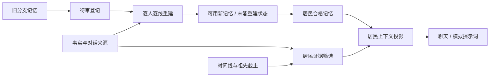

# K1：分叉设定与居民知识、时间线隔离 Plan

> 状态：整份 Plan 已获用户批准。
> 日期：2026-10-04。
> 输入：[已批准的 spec.md](spec.md)。四份规格文档全部批准前不开始实现。

## 架构概览

- **时间线证据读取层**读取当前时间线、合法祖先检查点、世界事实、对话发言和居民记忆。读取时保留来源时间、居民、时间线、可见范围及事实/传闻确定性；完整分叉设定只留在构造者和分叉管理路径。
- **居民上下文投影层**按“居民 × 时间线”生成可供模型使用的上下文。它复用现有事实校验、知识过滤和记忆可见性规则，加入可验证的亲历与实际听到的对话；缺少来源的内容不进入投影。
- **统一居民提示词契约**让普通聊天和自主模拟的所有提示词只接收上述居民专属上下文，不再直接接收包含完整分叉设定的时间线记录。多居民任务逐居民构造输入；接口无法表达逐人隔离时使用独立调用。
- **历史记忆重建服务**以居民和分叉时间线为单位，分批检查分叉点之后的记忆与摘要，从可验证的居民视角原始证据重建；保留原记录，另行记录重建结果。无法追溯到合格来源的派生内容标为未能重建，并在记忆读取和压缩时排除。
- **预算与失败护栏**让正常居民生成和历史重建继续走既有模型预算与请求记录；上下文或证据校验失败时不降级到完整设定，重建任务可观察、可续跑。

**需求归属：** F1–F4 由证据读取和居民投影满足；F6–F7 由提示词契约满足；F5、N3、N5 由历史重建服务和护栏满足。

## 核心数据结构与接口

### `ResidentEvidence`

居民可见证据的统一表示，来源于结构化世界事实、居民实际参与的对话发言、本人亲历记录或已经验证的记忆。

- `sourceId`：源事实、对话发言、事件或记忆的 ID。
- `timelineId`、`simTime`、`version`：来源时间线、虚拟时间及可用的状态版本。
- `recipientPersonId`：私人信息的指定接收者；公开环境事实与亲历记录可为空。
- `certainty`：`fact`、`rumor` 或 `inferred`，传播和摘要不得提升确定性。
- `content`、`sourceIds`：实际可提供给居民的内容及完整来源链。

### `ResidentPromptContext`

唯一可传入居民视角提示词的数据结构。包含居民身份、当前状态、世界与时间、该居民获准使用的证据和记忆、合法在场者及对话发言。时间线字段仅提供 ID、时间和“是否为分叉线”等非秘密信息；不包含完整时间线记录、`forkScenarioJson` 或未筛选的其他居民记忆。

### `MemoryRepairRun` 与 `MemoryRepairItem`

重建进度与逐条结果分开保存：

- `MemoryRepairRun` 按世界、时间线和居民标记批次状态、游标、计数及更新时间，状态包含 `pending`、`running`、`completed`、`needs_review`、`failed`。
- `MemoryRepairItem` 关联原派生记忆，标记 `pending`、`rebuilt` 或 `unreconstructable`，并记录可验证来源 ID、替代记忆 ID 或原因。
- 原记忆和原始证据保留。待重建或无法重建的原派生记忆不进入提示词或后续压缩；新重建记忆须有可验证来源后才可使用。

### 接口

```ts
buildResidentEvidence(
  db: Db,
  input: { worldId: string; timelineId: string; personId: string; asOfVersion?: number },
): Promise<ResidentEvidence[]>

buildResidentPromptContext(
  db: Db,
  input: { userId: string; worldId: string; timelineId: string; personId: string; mode: AgentMode },
): Promise<ResidentPromptContext | null>

repairResidentTimelineMemories(
  db: Db,
  input: { worldId: string; timelineId: string; personId: string; batchSize: number; cursor?: string },
): Promise<{ status: MemoryRepairRun['status']; nextCursor?: string; counts: Record<string, number> }>

buildSystemPrompt(context: ResidentPromptContext): string
buildEnginePrompt(context: ResidentPromptContext, step: EngineStep): PromptPair
```

这些接口规定输入边界和结果行为；具体表字段、错误码和批量调度方式在后续任务拆解中确定。

## 模块设计

### 1. 居民证据装配

**职责：** 读取指定时间线及合法祖先中可用的结构化事实和证据；按居民身份、可见范围、时间线截止和来源链构造 `ResidentEvidence`。对话仅把居民实际听到的发言作为可传播证据，不把其他人的内心想法当成共享事实。

**依赖：** 现有世界状态查询、`visibleKnowledgeForPerson`、分叉快照与祖先截止规则、对话参与者和发言记录。

### 2. 居民记忆与提示上下文投影

**职责：** 组合每位居民的获准证据、个人记忆和当前状态，生成 `ResidentPromptContext`。历史待重建、未能核实的记忆不进入上下文。分叉状态只显示非秘密的“处于分叉时间线”信息。

**对外接口：** `buildResidentPromptContext(...)`。

**依赖：** 居民证据装配、现有上下文装配和记忆读取；不读取构造者场景正文作为居民上下文。

### 3. 居民提示词构造

**职责：** 统一普通聊天、在场交谈、居民间对话、日程、生活节拍、突发事件反应、自主决策和记忆摘要提示词的输入契约。构造器只接受 `ResidentPromptContext`，不能经由 `Timeline` 取得原始完整分叉设定。

**对外接口：** `buildSystemPrompt(...)`、`buildEnginePrompt(...)`。

**依赖：** 居民记忆与提示上下文投影。面向构造者的分叉预览和面向用户的章节回顾保留独立上下文。

### 4. 历史记忆重建

**职责：** 找出既有分叉线中分叉点之后的居民记忆和摘要，按有限批次依据逐居民核验过的原始来源重建；无法证明来源的派生内容标记为不可重建。维护可续跑状态和逐条结果，不覆盖原始证据。

**对外接口：** `repairResidentTimelineMemories(...)`。

**依赖：** 居民证据装配、现有记忆压缩与预算记录。重建过程中生成的摘要走同一居民提示词契约。

### 5. 记忆资格与修复状态存储

**职责：** 保存重建批次和逐条状态；统一控制 `visibleMemories`、`retrieveForPrompt` 和 `oldestCompressible` 的资格过滤，避免待审或不可重建内容从另一条路径重新进入模型输入。

**依赖：** 数据库迁移及现有记忆查询。原始记忆始终保留以供审查，只有明确可用的重建结果重新进入居民输入。

**模块依赖顺序：** 居民证据装配 → 居民上下文投影 → 居民提示词构造；历史重建复用证据装配、上下文投影与提示词构造，并写入修复状态存储；记忆查询读取修复状态存储，不反向依赖重建服务。依赖图无环。

## 模块交互

### 日常居民模型调用

1. 请求确定世界、时间线、居民和调用类型。
2. 居民证据装配器按该居民、当前时间线版本及祖先截止读取允许的世界事实、私人知识和可验证的本人经历。
3. 记忆查询器只返回该居民在相应时间线合法可见、且修复状态允许使用的记忆。
4. 上下文投影器组合居民资料、当前状态、允许的在场者、对话发言和证据，产生 `ResidentPromptContext`。
5. 聊天或引擎提示词构造器只使用投影结果；如果构造失败或证据校验未通过，不发送含原始分叉设定的替代请求。

### 对话传播与记忆

- 对话回合按实际参与者逐个生成；每位居民只得到其角色有权看到的发言内容，不读取其他居民的内心想法。
- 记忆写入关联到实际对话、行动或事实来源。被转述的传闻继承原确定性；无法验证来源的陈述不会作为已证实事实传播。
- 居民间调用无法确保逐人输入隔离时，调度器拆成多个居民专属请求，并仍使用现有预算与失败记录。

### 分叉与后代时间线

- 新线读取分叉检查点前、其居民有权获知的证据，并按现有祖先时间/版本截止规则继承。
- 分叉点后写入当前时间线的证据只进入该线及其合法后代；提示词构造不从父线的最新状态、兄弟线或其他分支取未来信息。
- 缺少可验证截止时间或快照不完整的旧线进入待审状态；相关派生记忆在确认前不加入提示词。

### 历史重建与安全切换

1. 部署时识别已有分叉线及其分叉点后居民记忆；先登记待审资格，使其不再进入提示词或压缩源。
2. 重建器按时间线、居民和有限游标批处理，仅读取该居民可见的原始事实、发言和行动证据。
3. 有来源支持的内容写入新的可用派生记录，并将原记录标为已替代；无法证明的内容记录为未能重建且持续排除。
4. 每批提交记录与游标，使中断后可续跑且重试幂等。来源冲突、版本不匹配或重建失败时保留原始数据，任务进入可诊断状态。



**边界检查：** 在所有居民请求链路中，唯一可到达提示词构造器的数据为 `ResidentPromptContext`；构造者完整场景记录不参与此数据流。

## 文件组织

```text
api/src/agent/
├── resident-evidence.ts       — 居民证据读取、可见范围与来源链校验
├── resident-context.ts        — ResidentPromptContext 投影与逐居民隔离
├── memory.ts                  — 读取、检索、压缩前的资格过滤
├── memory-repair.ts           — 分叉后居民记忆重建与续跑
├── context.ts                 — 普通聊天上下文接入安全投影
├── engine-context.ts          — 自主模拟及摘要上下文接入安全投影
├── prompt.ts                  — 普通居民提示词只接受安全上下文
└── engine-prompt.ts           — 模拟提示词只接受安全上下文

api/src/admin/
└── memory-repair-routes.ts    — 管理员批次启动、续跑和进度读取

api/src/db/
└── schema.ts                  — 修复作业和记忆资格元数据定义

api/drizzle/
└── 0034_resident_memory_provenance.sql — 修复状态及记忆来源侧表

api/src/
└── index.ts                   — 注册受管理员鉴权保护的维护路由
```

验证文件将覆盖居民证据筛选、提示词输入、时间线继承/隔离、记忆资格与重建续跑；完整文件清单和具体验证命令留给 `task.md`。

## 技术决策

| 决策点 | 选择 | 理由 |
| --- | --- | --- |
| 居民提示词拿到的数据 | 使用不含原始时间线和 `forkScenarioJson` 的 `ResidentPromptContext` | 在类型边界阻止提示词从完整分叉设定取值 |
| 共享调用的隔离 | 每位居民单独构造上下文；无法保证调用输入隔离时拆分模型请求 | 保证不同居民的私人知识不合并 |
| 可用证据 | 使用居民可见的世界事实、其实际听到的对话发言、其本人经历及可追溯来源；无来源或截止不明时不提供 | 复用既有时间线和知识规则，避免由完整分叉设定推断居民认知 |
| 旧记忆处置 | 用独立侧表登记重建状态和来源，不覆盖原记忆；待审/不可重建记录退出读取与压缩候选 | 记忆是命令日志投影，独立元数据能保留原始数据并避免污染记录被其他路径重用 |
| 历史重建入口 | 新增管理员鉴权维护路由，每次只处理有界批次，返回游标和进度 | 运行在可访问 D1 与既有预算护栏的 Worker 环境，可在请求超时或失败后续跑；不增加用户界面 |
| 来源不足时的处理 | 标记未能重建，保留原始记录但持续从居民输入排除 | 不凭不完整证据生成替代记忆 |
| 部署顺序 | 新版提示路径先默认隔离既有分叉线分叉点后的未登记记忆，再通过维护路由逐批重建并显式登记合格结果 | 避免后台重建尚未完成时，旧记忆继续暴露在居民模型输入中 |

**覆盖检查：** Spec 的 F1–F7 均归属到上述模块；N1–N6 由类型边界、来源校验、独立修复状态、管理员批次护栏和验证记录覆盖。当前代码存在的完整分叉设定注入是明确修复入口；章节生成仍属面向用户路径，不在本 plan 的居民提示词改造范围内。
