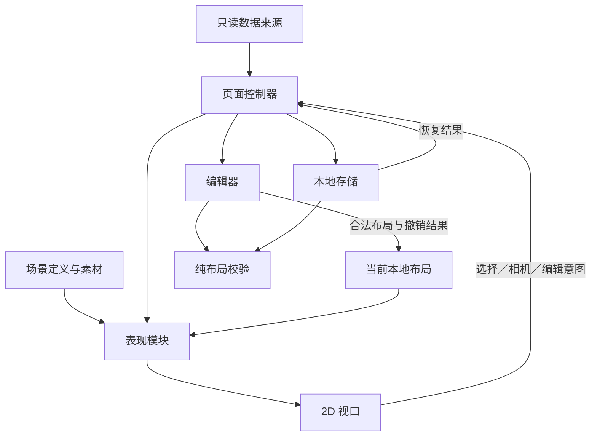

# N2D1：原生 2D 庄园可交互样板 Plan

> 状态：四份规格文档及任务拆解补充已全部获用户批准；用户要求暂不开发，等待明确启动指令。尚未开始实现。
> 日期：2026-10-04。
> 输入：[已批准的 spec.md](spec.md)。四份文档全部批准前不开始实现。

> 已批准的任务拆解补充：`web/vitest.config.ts` 仅新增 `native2d-e2e/**` 排除项，防止 Vitest 收集独立 Playwright 用例；不改变现有单元测试或 E2E 配置。其余已批准设计不变。

## 架构概览

保留现有 Vite、React 与 TypeScript 前端，新增独立的原生 2D 样板入口。React 负责控件、信息卡和状态反馈，PixiJS 8 负责精灵绘制、相机、深度排序与对象拾取。样板不挂载 3D 视口，不抽取或重构现有世界页，不新增后端存储或数据库迁移。

世界状态与本地布局分别保存。只有只读适配器能够更新世界读取结果；编辑器只能改变样板建筑位置。表现模块合并二者，向视口提供可绘制数据。

| 组件 | 职责 | 需求归属 |
|---|---|---|
| 样板页面与控制器 | 来源、刷新、当前空间、选择、跟随、编辑、恢复反馈 | F1、F2、F4、F5、F7、F8、F9 |
| 只读数据适配器 | 公开快照与固定数据转换，保留来源与真实身份 | F1、F2、F6 |
| 场景定义与素材 | 外景、大厅、地点绑定、占地、入口及分层素材 | F3、F4、F5、F7 |
| 场景表现模块 | 合并世界状态与本地布局，处理未知和无法呈现的地点 | F4、F5、F6 |
| 2D 视口与输入 | 相机、选择、跟随、空间显示、遮挡和编辑预览 | F3、F4、F5、F7 |
| 本地编辑器与纯校验 | 移动预览、应用前校验、位置差量撤销 | F7、F8 |
| 本地布局存储 | 按范围隔离、恢复校验、保存反馈与重置 | F9 |

## 核心数据结构

以下 TypeScript 声明是契约，不包含实现。数组与输入对象均按只读使用；模块通过新值更新状态，不修改传入的世界数据。格子坐标使用 x、z，屏幕及图片坐标使用 x、y。

```ts
type SourceKind = 'public' | 'fixture'
type TimeOfDay = 'dawn' | 'day' | 'dusk' | 'night' | 'unknown'

interface GridPoint { readonly x: number; readonly z: number }
interface PixelPoint { readonly x: number; readonly y: number }
interface GridBounds { readonly width: number; readonly depth: number }

interface SampleScope {
  readonly source: SourceKind
  readonly worldId: string
  readonly timelineId: string
  readonly sceneId: string
  readonly sceneVersion: number
}

interface WorldLocation {
  readonly name: string
  readonly description: string
}

interface WorldResident {
  readonly personId: string
  readonly name: string
  readonly locationName: string | null
  readonly activity: string | null
}

interface WorldReadModel {
  readonly scope: SampleScope
  readonly worldName: string
  readonly simNow: string | null
  readonly timeZone: string
  readonly stateVersion: number | null
  readonly locations: readonly WorldLocation[]
  readonly residents: readonly WorldResident[]
}

type ReadState =
  | { readonly status: 'loading'; readonly lastGood: WorldReadModel | null;
      readonly errorMessage: null; readonly receivedAt: string | null }
  | { readonly status: 'ready'; readonly lastGood: WorldReadModel;
      readonly errorMessage: null; readonly receivedAt: string }
  | { readonly status: 'stale'; readonly lastGood: WorldReadModel;
      readonly errorMessage: string; readonly receivedAt: string }
  | { readonly status: 'error'; readonly lastGood: null;
      readonly errorMessage: string; readonly receivedAt: null }

interface CameraHome {
  readonly focus: GridPoint
  readonly paddingPx: number
  readonly maxZoom: number
}

interface AssetLayer {
  readonly id: string
  readonly url: string
  readonly pixelWidth: number
  readonly pixelHeight: number
  readonly anchorPx: PixelPoint
  readonly role: 'base' | 'occluder' | 'accent'
  readonly sortOffset: number
  readonly visibleAt: readonly TimeOfDay[]
}

interface AssetDefinition {
  readonly id: string
  readonly layers: readonly AssetLayer[]
  readonly footprint: readonly GridPoint[]
  readonly sortAnchor: GridPoint
  readonly hitPolygon: readonly PixelPoint[]
}

interface StaticSceneObject {
  readonly id: string
  readonly assetId: string
  readonly origin: GridPoint
  readonly blocksMovement: boolean
}

interface SpaceDefinition {
  readonly id: string
  readonly kind: 'exterior' | 'interior'
  readonly bounds: GridBounds
  readonly walkableCells: readonly GridPoint[]
  readonly staticObjects: readonly StaticSceneObject[]
  readonly overview: CameraHome
  readonly connectivityRoot: GridPoint | null
}

interface BuildingDefinition {
  readonly id: string
  readonly assetId: string
  readonly spaceId: string
  readonly initialOrigin: GridPoint
  readonly entryOffset: GridPoint
  readonly locationKeys: readonly string[]
  readonly interiorSpaceId: string | null
}

type LocationRepresentation =
  | { readonly kind: 'outdoor'; readonly spaceId: string;
      readonly anchor: GridPoint; readonly residentSlots: readonly GridPoint[] }
  | { readonly kind: 'interior'; readonly spaceId: string;
      readonly entryBuildingId: string; readonly anchor: GridPoint;
      readonly residentSlots: readonly GridPoint[] }
  | { readonly kind: 'unrepresented'; readonly buildingId: string | null }

interface LocationBinding {
  readonly locationKey: string
  readonly sourceLocationName: string
  readonly representation: LocationRepresentation
}

interface SceneDefinition {
  readonly id: string
  readonly version: number
  readonly defaultSpaceId: string
  readonly spaces: readonly SpaceDefinition[]
  readonly buildings: readonly BuildingDefinition[]
  readonly locationBindings: readonly LocationBinding[]
  readonly assetManifest: Readonly<Record<string, AssetDefinition>>
}

interface BuildingPlacement {
  readonly buildingId: string
  readonly spaceId: string
  readonly origin: GridPoint
}

interface LayoutState {
  readonly scope: SampleScope
  readonly placements: readonly BuildingPlacement[]
}

type MoveReasonCode = 'out_of_bounds' | 'collision' | 'entrance_blocked'
  | 'disconnected' | 'missing_building' | 'invalid_asset'

interface MoveReason {
  readonly code: MoveReasonCode
  readonly message: string
  readonly buildingId: string | null
  readonly cells: readonly GridPoint[]
}

interface MoveValidation {
  readonly valid: boolean
  readonly conflictCells: readonly GridPoint[]
  readonly reasons: readonly MoveReason[]
}

interface MoveCommand {
  readonly buildingId: string
  readonly from: GridPoint
  readonly to: GridPoint
}

interface MovePreview {
  readonly buildingId: string
  readonly target: GridPoint
  readonly validation: MoveValidation
}

type EditResult =
  | { readonly ok: true; readonly layout: LayoutState }
  | { readonly ok: false; readonly reason: 'no_preview' | 'nothing_to_undo'
        | 'invalid_move'; readonly message: string;
      readonly validation: MoveValidation | null }

interface LocalLayoutRecord {
  readonly formatVersion: 1
  readonly scope: SampleScope
  readonly placements: readonly BuildingPlacement[]
  readonly savedAt: string
}

type StorageFailure = 'storage_unavailable' | 'quota_exceeded' | 'storage_error'

type SaveResult =
  | { readonly ok: true }
  | { readonly ok: false; readonly reason: StorageFailure; readonly message: string }

type RestoreResult =
  | { readonly status: 'none' }
  | { readonly status: 'ready'; readonly layout: LayoutState }
  | { readonly status: 'damaged'; readonly message: string }
  | { readonly status: 'incompatible'; readonly message: string }
  | { readonly status: 'error'; readonly reason: StorageFailure; readonly message: string }

type Selection =
  | { readonly kind: 'resident'; readonly personId: string }
  | { readonly kind: 'location'; readonly locationKey: string }
  | { readonly kind: 'building'; readonly buildingId: string }

interface ResidentPlacement {
  readonly personId: string
  readonly status: 'visible' | 'unrepresented' | 'unknown'
  readonly spaceId: string | null
  readonly point: GridPoint | null
  readonly reason: string | null
}

interface PresentedObject {
  readonly id: string
  readonly kind: 'building' | 'decoration' | 'resident' | 'location'
  readonly assetId: string | null
  readonly origin: GridPoint
  readonly selection: Selection | null
}

interface PresentedLocation {
  readonly locationKey: string | null
  readonly name: string
  readonly description: string
  readonly residentIds: readonly string[]
  readonly representation: 'outdoor' | 'interior' | 'unrepresented' | 'unknown'
}

interface ScenePresentation {
  readonly scope: SampleScope
  readonly spaceId: string
  readonly simNow: string | null
  readonly timeZone: string
  readonly timeOfDay: TimeOfDay
  readonly objects: readonly PresentedObject[]
  readonly residents: readonly WorldResident[]
  readonly residentPlacements: readonly ResidentPlacement[]
  readonly locations: readonly PresentedLocation[]
}

type ViewportEvent =
  | { readonly type: 'select'; readonly selection: Selection | null }
  | { readonly type: 'free-pan' }
  | { readonly type: 'move-target'; readonly buildingId: string; readonly target: GridPoint }
  | { readonly type: 'error'; readonly message: string }

interface ViewportDiagnostics {
  readonly width: number
  readonly height: number
  readonly resolution: number
  readonly renderer: string
  readonly drawCount: number
  readonly lastRenderMs: number
  readonly objectBounds: Readonly<Record<string, {
    readonly x: number; readonly y: number; readonly width: number; readonly height: number
  }>>
}

type SourceConfig =
  | { readonly kind: 'public'; readonly worldId?: string; readonly timelineId?: string }
  | { readonly kind: 'fixture'; readonly fixtureId: string }

interface WorldSource {
  load(signal: AbortSignal): Promise<WorldReadModel>
}

interface LayoutEditor {
  preview(buildingId: string, target: GridPoint): MoveValidation
  applyPreview(): EditResult
  cancelPreview(): void
  undo(): EditResult
  getLayout(): LayoutState
}

interface LayoutRepository {
  load(scope: SampleScope): RestoreResult
  save(layout: LayoutState): SaveResult
  reset(scope: SampleScope): SaveResult
}

interface Native2dViewport {
  setPresentation(value: ScenePresentation): void
  setSelection(value: Selection | null): void
  setFollow(personId: string | null): void
  setMovePreview(value: MovePreview | null): void
  showOverview(): void
  dispose(): void
}

declare function createWorldSource(config: SourceConfig, scene: SceneDefinition): WorldSource
declare function createInitialLayout(scene: SceneDefinition, scope: SampleScope): LayoutState
declare function validateLayout(scene: SceneDefinition, layout: LayoutState): MoveValidation
declare function validateBuildingMove(
  scene: SceneDefinition, layout: LayoutState, buildingId: string, target: GridPoint,
): MoveValidation
declare function resolveResidentPlacement(
  world: WorldReadModel, scene: SceneDefinition, layout: LayoutState, personId: string,
): ResidentPlacement
declare function buildPresentation(
  world: WorldReadModel, scene: SceneDefinition, layout: LayoutState, spaceId: string,
): ScenePresentation
declare function createLayoutEditor(scene: SceneDefinition, layout: LayoutState): LayoutEditor
declare function createLayoutRepository(
  scene: SceneDefinition, storageProvider: () => Pick<Storage, 'getItem' | 'setItem' | 'removeItem'>,
): LayoutRepository
declare function gridToProjected(point: GridPoint): PixelPoint
declare function projectedToGrid(point: PixelPoint): GridPoint
declare function createNative2dViewport(
  host: HTMLElement, scene: SceneDefinition,
  options: {
    readonly onEvent: (event: ViewportEvent) => void
    readonly onDiagnostics?: (value: ViewportDiagnostics) => void
  },
): Promise<Native2dViewport>
```

### 契约约束

- 上述类型和接口由 `types.ts` 导出；函数声明由对应职责模块实现并导出，声明本身不作为运行时代码。
- `GridPoint`、占地偏移和布局位置必须是有限整数；图片脚点、点击多边形和屏幕位置允许小数。
- `AssetDefinition.footprint` 相对物件原点，`sortAnchor` 决定脚点深度；每层图片的 `anchorPx` 指定自身对齐脚点。点击多边形以素材脚点为原点，独立于碰撞占地。
- 场景中空间、建筑、静态物件和地点键均唯一；素材引用、入口、室内绑定及居民示意站位必须有效。外景必须有可通行的 `connectivityRoot`。
- `LayoutState` 包含该样板的全部建筑且各一次，不允许增加建筑、修改素材、旋转或更换空间。布局不承载居民和世界事实。
- 大厅内居民只在大厅视图呈现；尚未提供内景的地点保留在场信息，不将居民移到建筑入口或外景道路。
- `ResidentPlacement.point` 是已知地点内的示意站位，不是新增世界事实。无法定位时为 null；没有动作证据时不生成动作动画。
- 撤销历史只存在于 `LayoutEditor` 当前实例。刷新后恢复位置，重新建立空撤销栈。
- `ViewportDiagnostics` 仅供开发验证，观察尺寸、绘制与屏幕边界，不提供修改状态的入口，也不显示在产品信息卡中。

## 模块设计

### 样板页面与控制器

**职责：** 组织数据来源、刷新、当前空间、选择、跟随、编辑与恢复反馈。页面调用已声明接口；控制器保存读取状态、当前布局、存储状态及跟随意图。

**接口：** 通过 `WorldSource.load` 读取，调用表现、编辑、存储和视口接口。接收 `ViewportEvent`；应用、取消、撤销和重置使用 DOM 控件。

**依赖：** 数据适配器、场景定义、表现模块、编辑器、本地存储与视口接口。

取消旧读取并以请求序号过滤晚到结果；组件卸载后不更新状态。当前数据及来源标签取自 `lastGood.scope`，不能把旧来源画面标成新来源。新范围确定后才加载对应布局。来源切换取消预览，清除原范围的选择与跟随，不将旧编辑状态带入新范围。

### 只读数据模块

**职责：** 读取真实雾影庄公开快照或固定测试快照，输出 `WorldReadModel`。

**接口：** `createWorldSource`、`WorldSource.load`。

**依赖：** `types.ts`、固定快照、现有 `WorldSnapshot` 类型和 `web/src/lib/world-time.ts`；不依赖渲染和编辑。

真实模式只发 GET：显式配置世界时读取 `/api/public/worlds/:id`；未配置时通过 `/api/public/demo` 发现演示世界，再校验其为本期雾影庄。不能因为发现接口返回某个演示副本，就将其冒充选定世界；不适配时给出明确错误，可配置目标公开 worldId。

首次成功读取确定 worldId 与 timelineId，后续刷新固定该时间线。请求只携带读取所需参数，使用独立的公开读取封装，不附加登录或访客凭证，不触发共享客户端的登录跳转副作用。不会读取体素场景以转换几何，也不创建访客 session。

适配器校验关键响应结构和身份，保留未知值。时间显示复用 `effectiveTimeZone` 与 `formatWorldTime`；昼夜使用同一有效世界时区下的小时计算。现有旧生活投影直接按 UTC 推导昼夜，不在本期改造或直接复用其推导结果。

### 场景定义与素材模块

**职责：** 提供原生庄园场景、素材清单和明确的地点映射。

**接口：** 导出一份有效的 `SceneDefinition` 及 `AssetDefinition` 清单。

**依赖：** 核心类型与独立静态图片资源。

外景包含主楼、温室花房、门房小屋及通向后山散步道的可读通路；首个室内为大厅。大厅对应主楼内景；书房、餐厅、图书室继续绑定主楼，但其内景为 `unrepresented`；温室花房和门房小屋本期同样只显示外部建筑与在场信息；后山散步道拥有外景锚点与示意站位。额外庭院、湖岸和植被属于样板装饰，不新增真实世界地点。

所有可移动建筑均使用独立素材与占地，地面不烘焙建筑。建筑绑定和主楼的大堂入口在场景定义中保持稳定；主楼移动后大厅仍为原空间。选定的冷色悬疑图作为风格参考，生产素材需独立制作并核验比例、脚点、入口与遮挡元数据。

### 场景表现模块

**职责：** 将世界状态与本地布局组合为当前空间的 `ScenePresentation`。

**接口：** `resolveResidentPlacement`、`buildPresentation`。

**依赖：** 核心类型、场景定义、当前布局、有效世界时间工具；不依赖 PixiJS。

按明确地点映射解析居民；按稳定 personId 顺序分配该地点预设的合法示意站位。映射缺失、内景未提供或站位不足时保留真实地点信息并返回定位限制，不挪到其他地点。快照变化只更新地点与已知活动；没有过程证据时不合成走路、交谈、阅读等动作。

### 视口与输入模块

**职责：** 绘制、固定投影、深度排序、相机、拾取、遮挡淡出及编辑预览。

**接口：** `createNative2dViewport`、`Native2dViewport`、`ViewportEvent`；开发验证可订阅读取 `ViewportDiagnostics`。

**依赖：** PixiJS 8、素材、投影与输入模块、表现数据；不依赖 API 或本地存储。

按脚点深度排序，遮挡层与本体分开。选中居民受遮挡时降低相关遮挡层透明度，同时保留可识别高亮。主体、地点标记与编辑反馈不受过度暗化影响。

采用 2:1 投影，基础格子绘制尺寸为 64×32 逻辑像素：投影 x 为 `(x-z)*32`，投影 y 为 `(x+z)*16`。指针先移除相机变换，再逆投影；编辑目标吸附到整数格子。返回全景依据当前空间的地面与图片范围计算，避免只计算地面而裁掉屋顶；缩放下限随可容纳全景的比例计算。

普通模式单指或鼠标拖动地图；触屏双指缩放。编辑模式先选择建筑并进入移动状态，再将单指或鼠标拖动解释为预览，不同时拖动地图。应用和取消通过显式按钮完成，重要操作不依赖悬停。

只在状态、相机、选中反馈或交互变化时合并请求重绘；不生成居民自主动画和空闲刷新循环。像素密度上限为 2。组件挂载只创建一个渲染实例；异步初始化完成时若页面已离开，立即清理，取消事件、观察器和本实例资源。渲染或素材加载失败保留控制器状态，提供重试反馈。

### 本地编辑与纯校验模块

**职责：** 预览、应用前再次校验、位置差量撤销；校验整体布局与入口连通。

**接口：** `createInitialLayout`、`validateLayout`、`validateBuildingMove`、`createLayoutEditor`、`LayoutEditor`。

**依赖：** 核心类型与场景定义；不依赖渲染器、数据读取和存储。

候选建筑占地不得越界、落在不可放置地面、与阻挡物件或其他建筑冲突，也不得覆盖固定地点锚点和必要示意站位。用基础可通行区域减去阻挡物件与全部建筑占地，确认连通起点有效，并以四方向搜索检查所有受影响建筑入口与固定地点。

非法预览保留原布局。应用时针对当前布局重新校验；成功才替换位置并记录 `MoveCommand`。撤销恢复对应位置并移除最近命令，世界数据不参与回滚。建筑编辑仅在外景进行。

### 本地存储模块

**职责：** 布局隔离、解析、恢复校验、保存及明确的重置结果。

**接口：** `createLayoutRepository`、`LayoutRepository`。

**依赖：** 核心类型、场景定义与纯布局校验；不调用编辑器和渲染器。

存储键使用独立前缀和来源、worldId、timelineId、sceneId 的无歧义组合。`formatVersion` 与 `sceneVersion` 放在载荷中并严格核对，保证场景更新后可以提示已有布局不兼容，而不是因为查不到新版本键就静默使用初始布局。

读取校验范围、结构、有限整数位置、建筑集合和完整布局合法性。损坏或不兼容时保留原记录，等待恢复选择；读取失败不会被报告为无存档。访问存储对象本身可能失败，故通过 `storageProvider` 捕获这类错误。

应用和撤销后由控制器调用保存；保存失败保留当前内存布局及撤销栈，标明未保存并可重试。重置经用户确认后清除对应键；清除成功才恢复初始布局并重建空撤销栈，失败保留当前布局。

## 模块交互

### 首次打开

加载场景与素材，同时读取选定来源 → 取得实际世界与时间线 → 建立范围 → 读取并校验本地布局 → 合并表现数据 → 绘制。

无存档使用初始布局；有效存档恢复；损坏或不兼容时显示原因及恢复入口，不静默覆盖。可先显示明确标记的初始布局预览，编辑与保存须等恢复选择完成。

### 手动刷新与来源切换

同范围刷新成功后保留布局，更新世界信息并重新解析选择与跟随。刷新失败保留最后成功的画面并标记尚未更新。被选居民已不存在或无法定位时显示对应反馈，不复用旧坐标冒充新状态。

切换来源取消旧请求和预览；新范围确定后恢复其布局并清除旧范围的选择与跟随。保留旧画面时，其标签仍说明旧来源。请求取消、序号检查和卸载清理共同避免晚到数据覆盖。

### 选择、跟随与室内观察

视口上报选择 → 控制器更新卡片、高亮与跟随意图 → 解析居民地点及可呈现空间 → 构造当前空间表现。

跟随居民进入已提供的大厅时自动切换观察空间；进入未提供内景或未知地点时暂停视觉跟随并显示真实地点与限制。保留跟随意图，后续刷新发现可定位时可恢复；用户取消跟随或主动拖动地图后自由浏览。观察室内不提交身份或居民位置变化。

### 建筑编辑与撤销

选择外景建筑 → 进入移动 → 更新预览 → 校验 → 用户应用 → 以当前布局再次校验 → 更新布局与撤销栈 → 控制器保存 → 更新表现。

非法目标不生效。取消预览不写存储。撤销成功后保存恢复的布局。保存失败不回退已应用布局，用户可以重试保存或继续撤销；当前尚未保存的情况必须可见。

### 刷新恢复与重置

刷新恢复位置而不恢复撤销历史。重置说明影响范围 → 用户确认 → 清除对应存档 → 成功后恢复初始布局并清空撤销历史；清除失败保留当前布局。



### 代码依赖与并行边界

代码依赖由核心类型向上展开：类型 → 场景、数据源、投影 → 表现、校验、视口输入 → 编辑器、存储、视口 → 控制器与页面。图中的状态反馈不构成模块导入环；控制器通过视口事件回调接收意图，视口不导入控制器。

编辑器与存储共同依赖纯校验，二者不互相调用。确定核心契约与场景元数据后，读取适配、编辑/存储、素材/渲染可由不同任务推进；控制器在这些模块汇合后接线。公共路由、依赖清单与锁文件由同一集成任务负责，避免并行覆盖。

## 文件组织

```text
web/src/native2d/
├── sample-page.tsx          页面与操作控件
├── Native2dViewport.tsx     渲染实例挂载、重试与清理
├── controller.ts            读取、选择、跟随及编辑协调
├── types.ts                 本文数据结构、接口与开发诊断类型
├── world-source.ts          公开只读数据适配
├── fixtures.ts              固定测试快照
├── scene.ts                 庄园布局、地点绑定与大厅
├── assets.ts                素材元数据
├── presentation.ts          世界状态与布局的表现转换
├── projection.ts            格子与屏幕坐标转换
├── viewport.ts              PixiJS 渲染与相机
├── input.ts                 鼠标、触屏与对象拾取
├── layout-validation.ts     占地和通路校验
├── editor.ts                预览、应用与撤销
├── storage.ts               本地保存、恢复与重置
├── sample.css               冷色悬疑界面样式
└── __tests__/
    ├── world-source.test.ts
    ├── scene.test.ts
    ├── presentation.test.ts
    ├── projection.test.ts
    ├── layout-validation.test.ts
    ├── editor.test.ts
    ├── storage.test.ts
    └── controller.test.ts

web/public/native2d/mist-manor/
├── buildings/               主楼、温室、门房的独立分层图片
├── terrain/                 地面、道路、水岸与植被
├── residents/               居民独立素材
└── hall/                    大厅地面、墙体、家具与遮挡层

web/native2d-e2e/
├── fixtures.ts              固定读取响应及可观察场景
├── sample.spec.ts           桌面数据、选择与空间流程
├── editing.spec.ts          校验、撤销、保存与恢复
├── sample.mobile.spec.ts    触屏完整旅程
└── readonly-live.spec.ts    真实公开 API 读取与身份绑定

web/playwright.native2d.config.ts
docs/spec_docs/N2D1-interactive-sample/
├── spec.md
├── plan.md
├── task.md
├── checklist.md
└── design/cold-mystery-reference-v1.png
```

公共文件变动限制如下：

| 文件 | 改动 | 所有权 |
|---|---|---|
| `web/src/App.tsx` | 按需加载 `/dev/native-2d` 独立路由，不改首页和世界页 | 集成任务 |
| `web/package.json` | 添加精确锁定的 PixiJS 8 依赖 | 集成任务 |
| `package-lock.json` | 依赖安装生成的锁文件变动 | 同一集成任务 |
| `web/vitest.config.ts` | 仅排除新增 `native2d-e2e/**` 浏览器测试目录；补充已批准 | 集成任务 |

不修改 `WorldCanvasPage.tsx`、`GuestWorldMap.tsx`、体素引擎、共享场景存储和数据库。只读快照类型与时间工具直接引用；公共接口变化通过主线同步后适配。

## 技术决策

| 决策点 | 选择 | 理由 |
|---|---|---|
| 前端与渲染 | React + PixiJS 8，优先 WebGL | 延续现有前端，提供精灵、排序和拾取能力，独立于 3D 视口 |
| 依赖版本 | 实现阶段安装 `pixi.js@8` 并使用 `--save-exact`，提交实际解析版本及锁文件 | 使用已核对的 v8 API，不将浮动版本留给后续安装 |
| 场景与投影 | 原生场景数据、整数格子、64×32 逻辑像素的 2:1 固定投影 | 占地、通路与图片绘制分开，缩放不改变布局 |
| 真实读取 | 现有公开 GET 接口，固定目标世界与首次确定的时间线 | 无需后端迁移，不产生访客副本、行动或世界存档 |
| 时间语义 | 世界时区下的世界时间与昼夜推导；未知时间有明确状态 | 避免页面时钟与场景相位来自不同时间基准 |
| 昼夜区间 | 按有效世界时区：夜间 20–6、黎明 6–9、白昼 9–17、黄昏 17–20 | 与现有地图启动投影区间对应，同时修正本期的时区来源 |
| 通路 | 四方向搜索，检查起点、所有受影响建筑入口及固定地点 | 可解释地阻止建筑移动造成的阻断 |
| 撤销 | 会话内位置差量；刷新只恢复布局 | 避免存储世界数据及复制整个场景，保持批准的恢复边界 |
| 本地记录 | 范围键隔离来源/世界/时间线/场景；载荷检查存储格式和场景版本 | 防止混用，兼容性失败可以被发现和解释 |
| 素材 | 冷色悬疑参考下的独立分层素材及元数据 | 保持美术方向并支持移动、拾取和遮挡 |
| 重绘与清理 | 交互/状态改变时合并重绘，像素密度上限 2，释放实例资源 | 控制空闲成本与本机资源，不靠持续模型或帧循环制造生活 |
| 浏览器验证 | 独立测试目录、配置、端口和输出；固定数据与真实公开读取分开记录 | 不混入现有 E2E，也不以 stub 通过替代真实 API 证据 |
| 分支与公共文件 | 独立功能分支及 worktree；路由、依赖和锁文件集中修改 | 与主线工作隔离，减少公共文件冲突 |
| 文档共享 | 开发启动时定向纳入本组四份文档与选定参考图 | 当前 docs 被忽略，规格和素材参考需随 worktree 共享 |

## 分支、服务与资源安排

- 拟使用 `codex/2d-experience` 功能分支与独立 worktree。创建时先检查是否有可复用的相关 worktree，并选用当时已提交、可验证的主线基线；不复制主目录未提交改动。当前已观察到主线含 S5B 完成提交 `74d01b4`，开发启动时重新确认基线。
- 四份文档全部批准后，定向把本目录规格及参考图纳入 Git，不改变其他 docs 的忽略范围，也不纳入其他任务的未提交改动。文档可通过专门提交同步到支线。
- 公共 API、快照类型和时间工具更新时同步 main → 2D 分支并验证适配；最终合并前验证主线 3D 核心路径。轻量模块工作可并行，依赖安装、构建和浏览器操作集中安排。
- 手工样板前端使用独立端口 5174，并按既有 Vite 代理连接现有 API；不额外启动节拍器或写入种子。
- 2D Playwright 前端默认端口 15174，输出目录 `/tmp/native2d-playwright-results`，配置仅管理本样板前端，worker 为 1。固定数据使用响应夹具且阻止写请求；真实读取场景不拦截公开 API，需要已经运行且有雾影庄数据的 API。
- 配置分为 `native2d-desktop`、`native2d-mobile` 与 `native2d-live` 三个项目，分别匹配桌面固定流程、移动固定流程及 `readonly-live.spec.ts`；固定验证显式选择前两个项目，真实读取单独选择最后一个。移动项目明确使用 390×844 触屏尺寸，不借用其他设备预设尺寸。
- 真实读取验证单独调度、记录实际执行结果；服务缺失时记为未完成，不能以固定数据测试代替。复用前端服务前确认其目录/版本与样板分支对应。
- 启动重型操作前综合检查 MemAvailable、vmstat 后续换页采样和 memory PSI，保留桌面余量；不凭 swap 使用率决定停工，不终止其他任务进程。验证结束清理本任务不再需要的进程和子进程。

## 规格覆盖与验证归属

| 需求 | 组件 | 验证归属 |
|---|---|---|
| F1 | 样板页面、只读数据适配器 | 数据适配测试；固定来源浏览器流程；真实公开读取与身份对照 |
| F2 | 数据源、控制器与读取反馈 | 成功、失败、重试、取消和晚到响应测试；浏览器旧数据标记 |
| F3 | 场景、投影、相机与视口 | 投影转换测试；实际平移缩放、全景和尺寸变化 |
| F4 | 地点映射、表现、控制器与拾取 | 选择、遮挡、跟随、无法呈现地点及自由浏览 |
| F5 | 主楼/大厅绑定、控制器与视口 | 大厅往返；主楼移动后的原室内访问；写请求检查 |
| F6 | 数据适配、表现与静态居民素材 | 未知、未提供内景及活动文本输入测试；检查无虚构动作 |
| F7 | 场景、校验、编辑器与预览 | 越界、占地、入口/通路阻断及合法移动；当前布局再次校验 |
| F8 | 编辑器、控制器与本地存储 | 多次移动逐步撤销；取消不保存；撤销不改世界状态 |
| F9 | 存储、纯校验与恢复页面 | 隔离、刷新、损坏、不兼容、读写失败及重置失败 |
| N1、N2 | 分层素材、排序与昼夜表现 | 冷色昼夜人工观察和截图；独立建筑移动与遮挡检查 |
| N3 | 输入、布局与 DOM 控件 | 1280×720 桌面及 390×844 触屏完整旅程 |
| N4、N5 | 世界/布局分离、范围校验及只读适配 | 输入不可变测试、范围隔离与浏览器请求记录 |
| N6 | 按需重绘、资源清理及集中调度 | 交互期间设备/renderer/帧率记录，页面切换资源清理检查 |
| N7、N8 | 控制器、存储反馈与独立验证配置 | 实际失败恢复；固定与真实证据分别记录；截图辅助验收 |

性能记录采集实际平移、缩放和移动预览期间的绘制，不把空闲按需渲染的低绘制次数报告为低帧率。自动化软件渲染证据与真实设备操作表现分别标注，不新增 spec 未承诺的通用 FPS 硬门槛。

## 设计依据

- 已批准的 [spec.md](spec.md) 与选定的 [冷色悬疑参考图](design/cold-mystery-reference-v1.png)。
- 现有公开接口：`api/src/public/routes.ts`；现有世界快照类型：`web/src/api/types.ts`；世界时间工具：`web/src/lib/world-time.ts`；雾影庄地点设定：`api/src/dev/seed-demo.ts`。
- [PixiJS 8 Application](https://pixijs.com/8.x/guides/components/application)：渲染初始化、WebGL 偏好、像素密度与 ticker 生命周期配置。
- [PixiJS 8 Events / Interaction](https://pixijs.com/8.x/guides/components/events)：鼠标/触屏指针事件与自定义点击区域。
