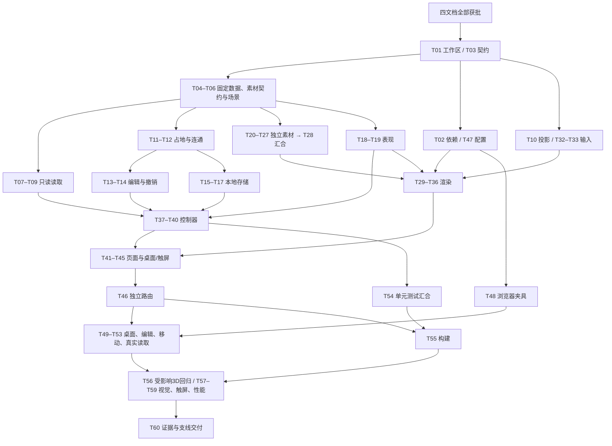

# N2D1：原生 2D 庄园可交互样板 Tasks

> 状态：开发和验收已完成；提交了原生2D实现、最终资源/遮挡/交互修复及验收证据。`codex/2d-experience`已同步验收时最新本地`main`（`2923d3d`），合并无冲突；2D/浏览器/生产/3D回归均通过。用户已明确授权完成后合入本地main、确认无冲突、删除2D分支并返回main。
> 输入：已批准的 [spec.md](spec.md)、[plan.md](plan.md)；日期：2026-10-04。
> 已一并批准的 plan 最小补充：`web/vitest.config.ts` 仅增加 `native2d-e2e/**` 排除项，防止 Vitest 执行 Playwright 用例。其余范围和设计沿用已批准内容。

## 开发门槛与任务粒度

四份文档已全部获批，2026-10-04 用户明确指示启动开发，文档审批门槛已满足。开发最初在`codex/2d-experience`上开始；主工作区之后被切回main，未提交的本任务变更保存在此隔离worktree，主工作区的删除/未跟踪内容原样保留。已完成所有验收和证据记录；按照用户授权将分支无冲突快进到main并清理分支/worktree。

共60个聚焦任务，每项按2–5分钟的主动操作单元组织。生图、网络安装、构建和浏览器测试的外部等待不承诺在5分钟内结束；等待期间不占用同文件编辑权。若实际实现需要更多主动操作，执行前按相同文件责任拆为子项，不能删掉验证或扩大范围。独立类型检查或定向测试是任务交付证据；浏览器操作和最终汇合验证另外记录，不能提前标成已通过。

## 文件清单

以下路径以本支线仓库根目录为基准；全部新实现限于原生2D样板目录。

| 操作 | 文件 | 责任/任务 |
|---|---|---|
| 新建 | `web/src/native2d/types.ts` | 统一契约，T03 |
| 新建 | `web/src/native2d/fixtures.ts`、`world-source.ts` | 固定与公开只读来源，T04、T07–T09 |
| 新建 | `web/src/native2d/assets.ts`、`scene.ts` | 素材元数据、空间与地点映射，T05、T06、T28 |
| 新建 | `web/src/native2d/projection.ts` | 正逆投影，T10 |
| 新建 | `web/src/native2d/layout-validation.ts`、`editor.ts`、`storage.ts` | 纯校验、移动/撤销、范围存储，T11–T17 |
| 新建 | `web/src/native2d/presentation.ts` | 事实一致的表现与世界昼夜，T18–T19 |
| 新建 | `web/src/native2d/input.ts`、`viewport.ts` | 拾取/手势、PixiJS绘制，T29–T36 |
| 新建 | `web/src/native2d/controller.ts` | 读取、布局、跟随与编辑协调，T37–T40 |
| 新建 | `web/src/native2d/Native2dViewport.tsx`、`sample-page.tsx`、`sample.css` | 页面、生命周期与桌面/触屏，T41–T45 |
| 新建 | `web/src/native2d/__tests__/{world-source,scene,presentation,projection,layout-validation,editor,storage,controller}.test.ts` | 定向行为验证，各模块任务 |
| 新建 | `web/public/native2d/mist-manor/buildings/*.png` | 主楼/温室/门房独立图层，T20–T22 |
| 新建 | `web/public/native2d/mist-manor/terrain/*.png` | 地面/道路/水岸/植被，T23–T24 |
| 新建 | `web/public/native2d/mist-manor/hall/*.png` | 大厅地面/墙体/家具，T25–T26 |
| 新建 | `web/public/native2d/mist-manor/residents/*.png` | 静态居民素材，T27 |
| 新建 | `web/native2d-e2e/{fixtures.ts,sample.spec.ts,editing.spec.ts,sample.mobile.spec.ts,readonly-live.spec.ts}` | 固定桌面/触屏与真实只读浏览器验证，T48–T53 |
| 新建 | `web/playwright.native2d.config.ts` | 独立测试目录、端口、项目与输出，T47 |
| 修改 | `web/src/App.tsx` | 独立懒加载路由，T46 |
| 修改 | `web/package.json`、`package-lock.json` | 精确PixiJS 8依赖，T02 |
| 修改（补充已批准） | `web/vitest.config.ts` | 仅排除新浏览器测试目录，T47 |
| 定向纳入/更新 | `docs/spec_docs/N2D1-interactive-sample/{spec,plan,task,checklist}.md`、`design/cold-mystery-reference-v1.png` | 开发门槛、进度与验收证据，T01、T57–T60 |

只读取现有 `api/src/public/routes.ts`、`api/src/dev/seed-demo.ts`、`web/src/api/types.ts`、`web/src/lib/world-time.ts` 和既有回归文件。不得改动世界页、3D视口、体素引擎、公共API、数据库和正式存档。

## 所有权与资源规则

- 主 agent 担任集成负责人，独占公共路由、依赖/锁文件、Vitest/Playwright配置、规格进度与最终同步。开始时向每个 subagent 传达用户 AGENTS 内存规则及本表的文件责任。
- 类型冻结后，读取、校验/编辑、存储、表现、投影/输入和素材可按下述DAG派发。角色表示责任，不要求一个角色永久占一个agent；同文件只能有一个当前写入者。
- 读取 T07→T08→T09、校验 T11→T12、编辑 T13→T14、存储 T15→T16→T17、表现 T18→T19、渲染 T29→T30→T31→T34→T35→T36、控制器 T37→T38→T39→T40、页面 T42→T43、样式 T44→T45 各自按文件串行。T51须等T49/T50交付后再修改两个桌面spec。
- T20–T27只写各自素材路径；清单由场景owner在T28统一汇合，素材任务不能各自改assets.ts/scene.ts。按imagegen技能生成/编辑，单层文件独立交付；使用view_image核对本地成品，不用Python裁切伪造拆层。
- 现有共4个agent槽位，主agent与最多3个轻量子任务可以并行。每批选择依赖已完成、文件互斥的任务；不因逻辑批次内任务多而同时启动全部。资源允许时使用完整轻量并发。
- 安装、构建、测试执行、浏览器及重型图片处理由主agent统一排程，通常一次一个重型操作；子agent在启动任何未计划重型操作前先协调。独立模块写作/审查可与已协调操作并行。
- 启动重型操作前执行 `free -h`、`vmstat 1 5`、`cat /proc/pressure/memory`，综合MemAvailable趋势、后续si/so和PSI，并检查适用的cgroup限制。保留桌面余量，不能仅凭swap已满禁用并行。
- 定向与完整Vitest均使用 `--maxWorkers=1`，独立Playwright使用 `workers:1`。内存压力升高时推迟下一重型任务；OOM后先缩小/排程，不盲增堆、不改swap/cache/system配置、不结束别人的进程。
- 复用对应工作区/版本的服务。手工前端5174；独立Playwright前端15174，代理已有API（默认8787），结果在 `/tmp/native2d-playwright-results`。端口占用时先识别归属再配置本任务端口，不终止他人服务。
- 每项独立交付验证完成才勾选本任务进度；后续集成验收由对应任务另行记录，不以类型/CSS解析通过冒充行为通过。每组逻辑相关任务提交。清理仅针对本任务不再需要的进程及子进程。

## 验证命令约定

单元任务写“运行某test.ts”时，实际执行仓库根目录下：

```bash
npm --workspace web test -- src/native2d/__tests__/对应文件.test.ts --maxWorkers=1
```

“类型检查”使用现有TypeScript配置，在web工作目录运行 `../node_modules/.bin/tsc --noEmit`，先确认本worktree对应依赖路径；不创建替代项目类型配置。模块交付时新类型错误必须修正，已有主线错误需单独记录而不能当作本任务通过。

独立浏览器命令在web目录运行：

```bash
../node_modules/.bin/playwright test --config=playwright.native2d.config.ts --project=native2d-desktop
../node_modules/.bin/playwright test --config=playwright.native2d.config.ts --project=native2d-mobile
../node_modules/.bin/playwright test --config=playwright.native2d.config.ts --project=native2d-live
```

定向用例在命令末尾加对应spec路径，三组分别调度。固定测试成功不能替代真实读取；没有目标API/数据时保留真实验证未完成状态。素材逐张预览属于当前任务独立验证，集成后的视觉与输入证据由T57/T58补齐。页面/视口早期任务以独立类型或CSS语法检查作为模块交付门槛，行为验收留给依赖它们的浏览器任务；两种状态分别记录。

## 任务列表

### T01：基线与独立工作区

- [x] 模块/任务交付并完成独立验证（2026-10-04：用户指定主工作区内新建分支 `codex/2d-experience`，基线 74d01b4；四文档+参考图定向纳入，提交 7410d00；主目录未提交改动未纳入）

**文件：** `docs/spec_docs/N2D1-interactive-sample/{spec,plan,task,checklist}.md`；`design/cold-mystery-reference-v1.png`

**负责人：** 集成；**依赖：** 无（须四文档全获批）；**粒度：** 2–5分钟主动操作。

**步骤：**
1. 四文档全部获批后复查主线已提交基线、现有附着 worktree 和他人改动；复用合适工作区或创建 codex/2d-experience 独立 worktree，不复制主目录未提交内容。
2. 定向纳入四文档与参考图并提交/同步到支线，保留其他 docs 忽略规则；记录工作目录、基线、分支和本任务进程账本。

**验证：** git status 与 git diff --cached --name-only 仅含本组批准文件；独立工作区基线明确，原目录其他任务改动未被修改。

### T02：安装精确依赖

- [x] 模块/任务交付并完成独立验证（pixi.js 8.22.0 --save-exact；npm ls 确认；仅 package.json+1 行与 lockfile+102 行；提交 633de0e）

**文件：** `web/package.json`；`package-lock.json`

**负责人：** 集成；**依赖：** T01；**粒度：** 2–5分钟主动操作。

**步骤：**
1. 集中检查 MemAvailable、vmstat 后续样本与 memory PSI；确认本工作区依赖是否可复用。
2. 使用 npm install --workspace web pixi.js@8 --save-exact，只由集成负责人更新依赖与锁文件。

**验证：** npm ls --workspace web pixi.js 显示实际 v8 版本；package.json 精确版本与锁文件一致，无非必要依赖变更。

### T03：建立统一类型契约

- [x] 模块/任务交付并完成独立验证（types.ts 覆盖 plan 全部类型与接口；tsc --noEmit 通过；提交 7fe5cb5）

**文件：** `web/src/native2d/types.ts`

**负责人：** 契约；**依赖：** T01；**粒度：** 2–5分钟主动操作。

**步骤：**
1. 将 plan 核心数据结构和接口转换为本模块导出类型，覆盖读取、范围、场景、布局、表现、编辑、存储和只读诊断。
2. 保留可辨别联合及 null/未知语义；运行时函数由各职责文件实现，types.ts 不导入 PixiJS、控制器或存储。

**验证：** 类型检查通过；逐项对照 plan 的类型与方法签名，无遗漏或另建冲突的 Selection 类型。

### T04：固定世界状态

- [x] 模块/任务交付并完成独立验证（固定世界状态（fixtures：昼夜/刷新/站位不足/未知/跨scope/居民消失；提交 e7ce2de））

**文件：** `web/src/native2d/fixtures.ts`

**负责人：** 读取；**依赖：** T03；**粒度：** 2–5分钟主动操作。

**步骤：**
1. 提供稳定 worldId/timelineId/personId 的雾影庄固定快照，覆盖大厅、后山散步道、未提供内景与未知地点/活动。
2. 分别提供昼夜、刷新后地点变化、站位不足及未知时间输入，保持 fixtureId 和 scope 确定，不随机生成数据。 提供至少两组确定的scope以验证来源/世界/时间线隔离，并覆盖居民从快照消失。

**验证：** 独立交付：运行类型检查并逐项对照固定输入清单，身份/未知/昼夜/跨范围用例确定；真实适配行为由T07及T54运行world-source.test.ts验证。

### T05：素材几何契约

- [x] 模块/任务交付并完成独立验证（素材几何契约（16 项 AssetDefinition 冻结；提交 3b4adb2））

**文件：** `web/src/native2d/assets.ts`

**负责人：** 场景；**依赖：** T03；**粒度：** 2–5分钟主动操作。

**步骤：**
1. 定义主楼、温室、门房、地形、植被、大厅和居民的素材 ID、生产文件名、目标尺寸/脚点、占地、点击多边形与图层角色。
2. 把入口、建筑占地和居民比例提供给素材任务；先冻结几何契约，图片文件由 T20–T27 交付，不把参考图登记为背景。

**验证：** 独立交付：运行类型检查，逐项对照AssetDefinition字段、有限整数占地、脚点/点击区与生产文件名；结构/引用运行证据在T06与T28的scene.test.ts汇合。

### T06：外景、大厅与地点绑定

- [x] 模块/任务交付并完成独立验证（外景、大厅与地点绑定（16×14 外景+6×5 大厅+七地点；scene.test 23 项通过；提交 68db20d））

**文件：** `web/src/native2d/scene.ts`；`web/src/native2d/__tests__/scene.test.ts`

**负责人：** 场景；**依赖：** T04、T05；**粒度：** 2–5分钟主动操作。

**步骤：**
1. 创建外景与大厅 SpaceDefinition、三栋建筑、基础可通行格子、固定阻挡/锚点/居民站位及有效 connectivityRoot。
2. 按计划绑定大厅、书房、餐厅、图书室、温室花房、门房小屋、后山散步道；检查唯一键、引用和站位，初始布局须合法。

**验证：** 运行 scene.test.ts：大厅绑定主楼，未提供内景地点为 unrepresented；引用唯一有效，必要锚点和站位可达。

### T07：固定来源适配

- [x] 模块/任务交付并完成独立验证（固定来源适配（world-source.test 含于 21 项；提交 1044d36））

**文件：** `web/src/native2d/world-source.ts`；`web/src/native2d/__tests__/world-source.test.ts`

**负责人：** 读取；**依赖：** T04、T06；**粒度：** 2–5分钟主动操作。

**步骤：**
1. 实现 createWorldSource 的固定数据分支及 WorldSource.load(signal)，产出 WorldReadModel，不读取 API、凭证或编辑状态。
2. 保持 fixture scope 与场景版本一致；处理中止信号，不复用可被外部修改的快照对象。

**验证：** 运行 world-source.test.ts：固定来源无网络请求，同一输入身份/时间稳定，中止后不报告成功。

### T08：公开 GET 与身份适配

- [x] 模块/任务交付并完成独立验证（公开 GET 与身份适配（GET+credentials:omit+雾影庄校验；提交 1044d36））

**文件：** `web/src/native2d/world-source.ts`；`web/src/native2d/__tests__/world-source.test.ts`

**负责人：** 读取；**依赖：** T07；**粒度：** 2–5分钟主动操作。

**步骤：**
1. 实现公开演示发现及显式 worldId 读取，独立 fetch 使用 GET、credentials: omit，校验目标雾影庄及关键响应结构。
2. 从现有 WorldSnapshot 提取居民、地点、已知活动和时间；保留未知值，不调用共享 apiFetch、访客创建或模型接口。

**验证：** 运行 world-source.test.ts：正确快照身份一致，错误世界/畸形响应明确失败；请求日志只有允许的公开 GET 且不携带凭证。

### T09：固定时间线与读取失败

- [x] 模块/任务交付并完成独立验证（固定时间线与读取失败（中止/乱序/重试语义；提交 1044d36））

**文件：** `web/src/native2d/world-source.ts`；`web/src/native2d/__tests__/world-source.test.ts`

**负责人：** 读取；**依赖：** T08；**粒度：** 2–5分钟主动操作。

**步骤：**
1. 首次成功后固定 worldId/timelineId，后续刷新携带同一时间线；发现或首次读取失败不错误固定范围。
2. 覆盖 HTTP 失败、中止、超时/网络失败和时间线不匹配；将可理解错误交给控制器，不附加自动轮询。

**验证：** 运行 world-source.test.ts：重复刷新不跳到最新时间线，首次失败可重试，abort 不产生伪成功；原始输入不被更改。

### T10：正逆投影

- [x] 模块/任务交付并完成独立验证（正逆投影（projection.test 11 项通过；提交 e7ce2de））

**文件：** `web/src/native2d/projection.ts`；`web/src/native2d/__tests__/projection.test.ts`

**负责人：** 投影；**依赖：** T03；**粒度：** 2–5分钟主动操作。

**步骤：**
1. 实现 gridToProjected 与 projectedToGrid，采用 64×32 的 2:1 公式；输入逆变换先去除相机平移/缩放。
2. 编辑吸附单独取整数目标，保持图片脚点允许小数；补充负坐标、缩放和平移后的往返验证。

**验证：** 运行 projection.test.ts：代表性格点与边界往返一致，缩放不修改布局格子，非法非有限坐标不能进入编辑状态。

### T11：布局结构与占地校验

- [x] 模块/任务交付并完成独立验证（布局结构与占地校验（layout-validation.test 含于 24 项；提交 a8ca3a8））

**文件：** `web/src/native2d/layout-validation.ts`；`web/src/native2d/__tests__/layout-validation.test.ts`

**负责人：** 校验；**依赖：** T06；**粒度：** 2–5分钟主动操作。

**步骤：**
1. 实现 createInitialLayout、validateLayout 与 validateBuildingMove 的结构/占地部分：范围、完整建筑集合、整数坐标、固定空间和素材。
2. 检查边界、不可放置地面、静态阻挡、建筑交叠及保护的地点锚点/必要站位；返回有原因和冲突格子的 MoveValidation。

**验证：** 运行 layout-validation.test.ts：合法基线通过，越界/重复或缺失建筑/NaN/重叠/锚点覆盖被阻止，输入布局不变。

### T12：入口与通路连通

- [x] 模块/任务交付并完成独立验证（入口与通路连通（四方向 BFS；提交 a8ca3a8））

**文件：** `web/src/native2d/layout-validation.ts`；`web/src/native2d/__tests__/layout-validation.test.ts`

**负责人：** 校验；**依赖：** T11；**粒度：** 2–5分钟主动操作。

**步骤：**
1. 从基础可通行格子减去阻挡和全部候选建筑占地，计算移动后的入口；验证 connectivityRoot 仍可通行。
2. 执行四方向 BFS，检查全部受影响入口及固定地点；区分入口阻挡和断路原因，使用同一完整布局校验支持恢复。

**验证：** 运行 layout-validation.test.ts：入口被堵、起点被堵、隔断其他建筑/后山通路均失败；绕行仍连通的合法移动通过。

### T13：编辑预览与应用

- [x] 模块/任务交付并完成独立验证（编辑预览与应用（editor.test 含于 20 项；提交 19c2e5f））

**文件：** `web/src/native2d/editor.ts`；`web/src/native2d/__tests__/editor.test.ts`

**负责人：** 编辑；**依赖：** T12；**粒度：** 2–5分钟主动操作。

**步骤：**
1. 实现 createLayoutEditor、preview、applyPreview、cancelPreview、getLayout；非法预览不改布局。
2. 应用时对当前布局重新校验，成功后记录 from/to 差量；编辑器不调用读取、视口或存储。

**验证：** 运行 editor.test.ts：取消保持原布局，无预览/非法预览不能应用；验证针对当前布局而非信任旧结果。

### T14：逐步撤销

- [x] 模块/任务交付并完成独立验证（逐步撤销（会话内差量栈；提交 19c2e5f））

**文件：** `web/src/native2d/editor.ts`；`web/src/native2d/__tests__/editor.test.ts`

**负责人：** 编辑；**依赖：** T13；**粒度：** 2–5分钟主动操作。

**步骤：**
1. 实现 undo 的会话内 MoveCommand 栈，逐次恢复对应位置；没有历史返回明确失败，重新建编辑器不继承旧栈。
2. 覆盖不同建筑和同建筑多次移动；撤销数据只包含布局位置，不复制世界快照。

**验证：** 运行 editor.test.ts：连续移动后反向逐步恢复，输入世界数据不变，新实例撤销栈为空。

### T15：范围键与存储记录

- [x] 模块/任务交付并完成独立验证（范围键与存储记录（storage.test 含于 25 项；提交 15b1a10））

**文件：** `web/src/native2d/storage.ts`；`web/src/native2d/__tests__/storage.test.ts`

**负责人：** 存储；**依赖：** T12；**粒度：** 2–5分钟主动操作。

**步骤：**
1. 实现 createLayoutRepository，键采用独立前缀与 source/worldId/timelineId/sceneId 的无歧义组合。
2. 载荷包含 formatVersion: 1、sceneVersion、完整 placements 与 savedAt，不保存世界快照或撤销历史；场景版本不放到键中。

**验证：** 运行 storage.test.ts：来源/世界/时间线/场景分别隔离，带分隔符身份不会串键；序列化只包含批准字段。

### T16：恢复与损坏识别

- [x] 模块/任务交付并完成独立验证（恢复与损坏识别（五态分流原记录不变；提交 15b1a10））

**文件：** `web/src/native2d/storage.ts`；`web/src/native2d/__tests__/storage.test.ts`

**负责人：** 存储；**依赖：** T15；**粒度：** 2–5分钟主动操作。

**步骤：**
1. load 校验 JSON、格式/场景版本、完整 scope、结构和完整布局合法性；分别返回 none/ready/damaged/incompatible/error。
2. 损坏、不兼容及读取异常保留原记录，等待显式重置，不静默覆盖或将异常当作无存档。

**验证：** 运行 storage.test.ts：坏 JSON、错范围/版本、非法布局正确分流且原值不变；缺记录才返回 none。

### T17：保存和重置故障

- [x] 模块/任务交付并完成独立验证（保存和重置故障（配额/不可用/删除失败语义；提交 15b1a10））

**文件：** `web/src/native2d/storage.ts`；`web/src/native2d/__tests__/storage.test.ts`

**负责人：** 存储；**依赖：** T16；**粒度：** 2–5分钟主动操作。

**步骤：**
1. save/reset 返回明确 SaveResult，storageProvider 的获取、getItem/setItem/removeItem 异常均被捕获。
2. 区分配额不足、不可访问与其他错误；清除失败不伪报成功，仓库不私自改变编辑器内存布局。

**验证：** 运行 storage.test.ts：存储 getter 失败、写满、删除失败有可理解原因，成功保存可恢复，失败不会删除原值。

### T18：居民与地点表现

- [x] 模块/任务交付并完成独立验证（居民与地点表现（presentation.test 含于 29 项；提交 6609d17））

**文件：** `web/src/native2d/presentation.ts`；`web/src/native2d/__tests__/presentation.test.ts`

**负责人：** 表现；**依赖：** T06、T12；**粒度：** 2–5分钟主动操作。

**步骤：**
1. 实现 resolveResidentPlacement，按 personId 稳定排序分配已知地点合法站位；大厅居民只放大厅。
2. 未知地点、未提供内景和站位不足保留真实归属并返回定位限制；活动文本仅如实呈现，不生成行为过程。

**验证：** 运行 presentation.test.ts：室内/外景归属准确，移动建筑不改变地点/personId，未呈现地点无假居民位置，同输入定位稳定。

### T19：场景表现与世界昼夜

- [x] 模块/任务交付并完成独立验证（场景表现与世界昼夜（边界小时/跨时区；提交 6609d17））

**文件：** `web/src/native2d/presentation.ts`；`web/src/native2d/__tests__/presentation.test.ts`

**负责人：** 表现；**依赖：** T18；**粒度：** 2–5分钟主动操作。

**步骤：**
1. 实现 buildPresentation，组合当前空间静态物件、布局、地点与居民，复用 effectiveTimeZone 与 formatWorldTime。
2. 按有效世界时区推导夜20–6/黎明6–9/昼9–17/暮17–20，未知时间保留 unknown；不依赖浏览器本地时区。

**验证：** 运行 presentation.test.ts：四个边界小时及 UTC/世界时区跨日输入正确，未知时间明确；同一 simNow 的文本与光照相位一致。

### T20：主楼独立素材

- [x] 模块/任务交付并完成独立验证（主楼独立透明图层已交付；contact sheet 预览和外景合成确认。）

**文件：** `web/public/native2d/mist-manor/buildings/main-house-{base,occluder,accent}.png`

**负责人：** 素材；**依赖：** T05；**粒度：** 2–5分钟主动操作。

**步骤：**
1. 按冻结的主楼尺寸/脚点生成冷色悬疑素材组，保留可见入口和暖光；透明背景，不带地面、人物、文字。
2. 将主体、前景遮挡和可调亮度光层独立导出，核对实际像素/透明度；需要修订时使用 imagegen 编辑。

**验证：** 逐张预览并对照参考图：入口和脚点一致，背景透明；整栋移动不遗留背景建筑，层合成无错位。

### T21：温室独立素材

- [x] 模块/任务交付并完成独立验证（温室独立透明图层已交付；contact sheet 预览和场景引用测试通过。）

**文件：** `web/public/native2d/mist-manor/buildings/greenhouse-{base,occluder,accent}.png`

**负责人：** 素材；**依赖：** T05；**粒度：** 2–5分钟主动操作。

**步骤：**
1. 生成与主楼同投影、比例和冷色光照规则的温室分层透明素材，保留明亮入口。
2. 核验 base/occluder/accent 尺寸与脚点一致，不把居民或道路画入建筑。

**验证：** 逐张预览：温室轮廓/玻璃层次可辨，透明合成对齐，入口在规定 footprint 边缘。

### T22：门房独立素材

- [x] 模块/任务交付并完成独立验证（门房独立透明图层已交付；contact sheet 预览和场景引用测试通过。）

**文件：** `web/public/native2d/mist-manor/buildings/gatehouse-{base,occluder,accent}.png`

**负责人：** 素材；**依赖：** T05；**粒度：** 2–5分钟主动操作。

**步骤：**
1. 按契约生成门房三层透明素材，与庄园建筑比例一致；入口与暖灯清楚。
2. 检查屋顶前景遮挡可单独淡出，建筑不含固定道路或人物。

**验证：** 逐张预览：透明背景、对齐脚点，移到不同地面仍成立；与主楼/温室风格一致。

### T23：地面、道路与水岸

- [x] 模块/任务交付并完成独立验证（外景地面/道路/岸线素材已交付并在场景合成中验证。）

**文件：** `web/public/native2d/mist-manor/terrain/{ground,path,shore}.png`

**负责人：** 素材；**依赖：** T05；**粒度：** 2–5分钟主动操作。

**步骤：**
1. 生成可组合的冷色草地/地面、明亮通路和水岸素材，遵守2:1格子比例与接缝规则。
2. 保留建筑、居民、家具为空；道路视觉位置必须能对齐 scene 可通行区域。

**验证：** 平铺/组合预览：路与地面有稳定明度差，接缝不明显，图中无烘焙建筑与人物。

### T24：植被与外景遮挡

- [x] 模块/任务交付并完成独立验证（植被本体与遮挡层已交付；contact sheet 和外景绘制通过。）

**文件：** `web/public/native2d/mist-manor/terrain/{tree-base,tree-occluder,shrub}.png`

**负责人：** 素材；**依赖：** T05；**粒度：** 2–5分钟主动操作。

**步骤：**
1. 生成低饱和植被透明素材，树干基部与树冠遮挡分离，限定比例和阴影范围。
2. 核对遮挡层脚点和 sortOffset；不遮蔽整条通路或侵入必要入口可读区。

**验证：** 合成预览：树干/树冠对齐，遮挡层可独立淡出，人物轮廓在邻近植被中仍可辨。

### T25：大厅地面与墙体

- [x] 模块/任务交付并完成独立验证（大厅地面/墙体图层已交付并在大厅浏览用例中绘制。）

**文件：** `web/public/native2d/mist-manor/hall/{floor,wall-base,wall-occluder}.png`

**负责人：** 素材；**依赖：** T05；**粒度：** 2–5分钟主动操作。

**步骤：**
1. 制作同一固定投影下的大厅地面及分层墙体，透明背景，出入口可读。
2. 前景墙体单独成层，留出场景规定居民站位与观察空间，不绘制人物。

**验证：** 预览：地板、墙体和入口比例一致，前景墙淡出后居民可见；地板上没有烘焙家具。

### T26：大厅家具

- [x] 模块/任务交付并完成独立验证（大厅家具使用独立素材；大厅入口/返回浏览器用例通过。）

**文件：** `web/public/native2d/mist-manor/hall/{table,chair,lamp}.png`

**负责人：** 素材；**依赖：** T05；**粒度：** 2–5分钟主动操作。

**步骤：**
1. 制作透明桌、椅、灯独立图片，沿用大厅比例、光照和脚点约定。
2. 核对静态阻挡与素材外形匹配，灯具亮层可以保持局部暖色。

**验证：** 合成预览：家具可独立摆放，无墙/人物背景；不覆盖大厅必要站位与入口。

### T27：居民素材

- [x] 模块/任务交付并完成独立验证（居民透明素材已交付；固定与真实读取页面绘制通过。）

**文件：** `web/public/native2d/mist-manor/residents/{resident-a,resident-b,resident-c}.png`

**负责人：** 素材；**依赖：** T05；**粒度：** 2–5分钟主动操作。

**步骤：**
1. 制作同尺度静态居民透明素材，冷色衣饰、清楚轮廓，作为 personId 的稳定表现，不创造真实动作。
2. 检查脚点统一、昼夜可读；不制作没有数据依据的走路/交谈动画。

**验证：** 预览相同缩放下人物大小一致，背景透明；深色地面和室内背景中仍可选辨。

### T28：素材清单汇合与校准

- [x] 模块/任务交付并完成独立验证（scene.test 验证清单引用/几何契约；最终外景桌面/手机截图检查通过。）

**文件：** `web/src/native2d/assets.ts`；`web/src/native2d/__tests__/scene.test.ts`

**负责人：** 场景；**依赖：** T06、T20、T21、T22、T23、T24、T25、T26、T27；**粒度：** 2–5分钟主动操作。

**步骤：**
1. 将生产文件接入冻结清单，核对图片实际尺寸、alpha、脚点、点击区域、遮挡层和 accent 可见时段。
2. 若图片不符冻结占地/入口，先修素材；几何契约修订须协调相关 owner，再重跑场景和布局验证。

**验证：** 所有清单 URL 对应真实文件；场景/素材测试通过，逐层组合无错位，参考图不作为单张场景背景。

### T29：视口实例与生命周期

- [x] 模块/任务交付并完成独立验证（视口实例与生命周期（骨架 tsc 通过，行为证据留 T41/T51/T59；提交 0de828d））

**文件：** `web/src/native2d/viewport.ts`

**负责人：** 渲染；**依赖：** T02、T06、T10；**粒度：** 2–5分钟主动操作。

**步骤：**
1. 实现 createNative2dViewport 异步 PixiJS 8 初始化、WebGL 偏好、DPR≤2、host 自适应及接口骨架。
2. 关闭自主 ticker，采用合并请求重绘；建立实例专属 dispose，取消监听、ResizeObserver、待绘帧并释放拥有的资源。

**验证：** 独立交付：运行类型检查，createNative2dViewport与Native2dViewport签名一致；不声称此时已通过画面/lifecycle操作。单实例、异步卸载、资源释放的实际证据由T41/T51/T59补齐。

### T30：分层绘制与深度

- [x] 模块/任务交付并完成独立验证（素材分层/遮挡在外景与大厅可见；桌面/手机浏览器用例通过。）

**文件：** `web/src/native2d/viewport.ts`

**负责人：** 渲染；**依赖：** T28、T29、T19；**粒度：** 2–5分钟主动操作。

**步骤：**
1. 实现 setPresentation，按图片脚点/sortAnchor 深度绘制地面、建筑、装饰、地点与居民，避免全场图片重复创建。
2. 切换空间同步替换当前图层，以世界昼夜调光但保留人物、通路、入口与高亮；不创建居民自主动画。

**验证：** 独立交付：运行类型检查及scene.test.ts/presentation.test.ts，表现数据、图层引用与接口一致；实际外景/大厅合成、昼夜和遮挡尚待T49/T57操作验收。

### T31：相机与全景

- [x] 模块/任务交付并完成独立验证（相机约束、全景和对象bounds由完整 browser project 验证。）

**文件：** `web/src/native2d/viewport.ts`

**负责人：** 渲染；**依赖：** T30；**粒度：** 2–5分钟主动操作。

**步骤：**
1. 实现平移、缩放边界和 showOverview，全景计算同时包含地面和图片 bounds，缩放下限由容纳全景计算。
2. 适配 host 改变尺寸，保持固定投影；跟随/空间切换相机指令使用同一相机状态。

**验证：** 独立交付：运行类型检查与projection.test.ts，相机变换接口及往返正确；全景屋顶、尺寸变化和布局不变的真实操作由T49/T52记录。

### T32：指针拾取与拖图

- [x] 模块/任务交付并完成独立验证（指针拾取与拖图（input.test 含于 25 项；提交 1fd4719））

**文件：** `web/src/native2d/input.ts`

**负责人：** 输入；**依赖：** T10、T06；**粒度：** 2–5分钟主动操作。

**步骤：**
1. 建立鼠标/单指 pointer 状态、点击阈值与基于独立 hitPolygon 的对象拾取，输出 ViewportEvent。
2. 普通模式拖图，建筑移动模式拖预览；取消/抬起后清理捕获，编辑目标由逆投影吸附整数。

**验证：** 独立交付：运行类型检查及projection.test.ts，逆投影与事件联合类型匹配；实际点击阈值、拾取和移动/拖图互斥由T49/T50验证。

### T33：触屏缩放与手势取消

- [x] 模块/任务交付并完成独立验证（触屏缩放与手势取消（提交 1fd4719））

**文件：** `web/src/native2d/input.ts`

**负责人：** 输入；**依赖：** T32；**粒度：** 2–5分钟主动操作。

**步骤：**
1. 增加双指中心/距离缩放，单指/双指转换不误触选中或应用；处理 pointercancel 和离开视口。
2. 保持重要操作通过 DOM 显式按钮，双指手势不能触发建筑应用或同时拖图。

**验证：** 独立交付：运行类型检查并对照pointercancel/单指—双指转换的事件分支，无接口错误；T52/T58实际触屏验证连续缩放、取消不粘连与不误保存。

### T34：选择、跟随与遮挡

- [x] 模块/任务交付并完成独立验证（controller/presentation/input 单测与桌面居民选择、跟随及空间切换通过。）

**文件：** `web/src/native2d/viewport.ts`

**负责人：** 渲染；**依赖：** T31、T33；**粒度：** 2–5分钟主动操作。

**步骤：**
1. 接入 input.ts，实现 setSelection/setFollow，高亮已知对象；根据被选居民与遮挡层交叠淡出相关层。
2. 跟随仅接受表现中可定位的居民，平移发 free-pan 供控制器取消；空间切换交给控制器。

**验证：** 独立交付：运行类型检查及presentation.test.ts，选择/跟随只使用已知定位和合法ViewportEvent；实际遮挡高亮、自由拖图取消、不虚构位置由T49/T57验收。

### T35：建筑移动预览

- [x] 模块/任务交付并完成独立验证（建筑拖动只捕获已选建筑，空地仍平移；三栋建筑合法移动与非法候选覆盖。）

**文件：** `web/src/native2d/viewport.ts`

**负责人：** 渲染；**依赖：** T34、T14；**粒度：** 2–5分钟主动操作。

**步骤：**
1. 实现 setMovePreview，显示独立候选建筑、占地/冲突格与合法/非法状态，保留原建筑实际布局。
2. 输出 move-target 事件给控制器；视口不调用仓库或私自应用位置，取消预览恢复常规渲染。

**验证：** 独立交付：运行类型检查及editor.test.ts，预览与move-target契约一致且编辑器非法/取消不改布局；连续视觉反馈与无提前保存由T50操作验证。

### T36：渲染故障与只读诊断

- [x] 模块/任务交付并完成独立验证（资产失败/重试、渲染计数/时长/对象边界诊断已由浏览器与视口测试验证；初始化失败注入另列 T59 未完成。）

**文件：** `web/src/native2d/viewport.ts`

**负责人：** 渲染；**依赖：** T35；**粒度：** 2–5分钟主动操作。

**步骤：**
1. 统一纹理/renderer/context 错误事件，失败时停止失效实例，保留控制器状态并允许重建。
2. 提供开发限定 onDiagnostics：尺寸、resolution、renderer、drawCount、lastRenderMs、objectBounds；不暴露状态修改接口。

**验证：** 独立交付：运行类型检查并审查诊断类型为只读观察、错误事件符合ViewportEvent；T51故障注入验证重试，T59记录资源/性能，不提前宣称运行通过。

### T37：控制器读取协调

- [x] 模块/任务交付并完成独立验证（全量 controller 单测通过，读请求失败、竞态及重试行为覆盖。）

**文件：** `web/src/native2d/controller.ts`；`web/src/native2d/__tests__/controller.test.ts`

**负责人：** 控制器；**依赖：** T09、T19；**粒度：** 2–5分钟主动操作。

**步骤：**
1. 管理 ReadState、请求序号与 AbortController：读取成功更新，失败保留 lastGood 并标记 stale，无旧数据时 error。
2. 来源切换/卸载取消读取，过滤晚到结果；画面和标签来自同一 lastGood.scope，新范围确定前不加载旧布局。

**验证：** 运行 controller.test.ts：乱序、切换失败、卸载晚到响应被过滤，旧画面不会被标成新来源，手动重试可恢复。

### T38：控制器布局恢复与保存

- [x] 模块/任务交付并完成独立验证（controller/storage 单测及浏览器范围隔离、损坏恢复、配额重试通过。）

**文件：** `web/src/native2d/controller.ts`；`web/src/native2d/__tests__/controller.test.ts`

**负责人：** 控制器；**依赖：** T37、T17、T14；**粒度：** 2–5分钟主动操作。

**步骤：**
1. 新 scope 确定后恢复对应布局或建立基线，处理 damaged/incompatible/error；不会未提示就覆盖坏记录。
2. 保存失败保留内存布局和撤销栈，提供未保存/重试状态；范围切换清空预览、旧选择/跟随及旧会话历史。 损坏/不兼容记录待恢复选择期间阻止编辑覆盖；同范围刷新只更新事实，不重载布局或清空撤销。

**验证：** 运行 controller.test.ts：范围隔离、坏记录保留、读写失败反馈、重试成功，来源切换无旧编辑串入。

### T39：控制器选择与空间跟随

- [x] 模块/任务交付并完成独立验证（controller 单测及桌面/手机选择、跟随和大厅切换通过。）

**文件：** `web/src/native2d/controller.ts`；`web/src/native2d/__tests__/controller.test.ts`

**负责人：** 控制器；**依赖：** T38；**粒度：** 2–5分钟主动操作。

**步骤：**
1. 组织居民/地点/建筑选择与外景—大厅切换；跟随已呈现居民按新读取位置更新，进入大厅时自动切换。
2. 未提供内景/未知地点暂停视觉定位并保留跟随意图，后续可呈现时恢复；取消或自由拖图终止意图。 目标居民消失时清理无效选择并明确反馈，不保留假位置。

**验证：** 运行 controller.test.ts：大厅往返、不呈现提示、恢复跟随和 free-pan 取消正确；观察与跟随无写 API。

### T40：控制器编辑与重置

- [x] 模块/任务交付并完成独立验证（controller/editor 单测及浏览器应用、撤销、确认/取消重置通过。）

**文件：** `web/src/native2d/controller.ts`；`web/src/native2d/__tests__/controller.test.ts`

**负责人：** 控制器；**依赖：** T39；**粒度：** 2–5分钟主动操作。

**步骤：**
1. 接线外景限定的预览、显式应用/取消、逐步撤销与保存；合法应用后更新表现，室内绑定保持原标识。
2. 重置先确认范围，再调用 repository.reset；成功后才恢复基线/清空历史，失败保留当前状态；取消无保存。

**验证：** 运行 controller.test.ts：移动/撤销/取消链路及保存失败正确；重置取消、删除失败均不改变布局。

### T41：React 视口挂载与重试

- [x] 模块/任务交付并完成独立验证（完整单测/生产预览通过；缺失纹理恢复后事实和视口可用。）

**文件：** `web/src/native2d/Native2dViewport.tsx`

**负责人：** 视图；**依赖：** T36；**粒度：** 2–5分钟主动操作。

**步骤：**
1. 建立 host/ref 与视口创建、状态更新、错误反馈和重试；effect 清理防止异步 init 完成后回写。
2. 只挂载一个实例，重试释放前一实例，React 状态与 renderer 生命周期分离。

**验证：** 独立交付：运行类型检查，props/effect清理与Native2dViewport接口匹配；初始化中卸载、重试布局保留和无悬挂实例由T51/T59实际验收。

### T42：页面读取与事实信息

- [x] 模块/任务交付并完成独立验证（固定/公开来源、地点/居民信息、失败重试由桌面与 live 浏览器用例通过。）

**文件：** `web/src/native2d/sample-page.tsx`

**负责人：** 视图；**依赖：** T40、T41；**粒度：** 2–5分钟主动操作。

**步骤：**
1. 创建来源选择、手动刷新、世界时间、读取反馈、居民/地点列表与事实信息卡，接入控制器和视口。
2. 对 unknown、未提供内景、示意站位和 stale 使用可理解文字；大厅入口/返回及跟随取消可直接操作。

**验证：** 类型检查通过；真实与固定来源标记、活动原文、大厅往返及跟随入口可达；浏览器证据在 T49/T53。

### T43：页面编辑与恢复控件

- [x] 模块/任务交付并完成独立验证（编辑/恢复控件的移动、撤销、重置确认、损坏记录及保存重试浏览器用例通过。）

**文件：** `web/src/native2d/sample-page.tsx`

**负责人：** 视图；**依赖：** T42；**粒度：** 2–5分钟主动操作。

**步骤：**
1. 增加建筑选择、移动、应用、取消、撤销、保存重试与重置确认，展示冲突原因和本地影响范围。
2. 恢复失败提供明确选择，损坏记录不静默删除；室内禁用编辑，无有效预览时不能应用。

**验证：** 类型检查通过；非法状态不可提交、主要操作有可访问名称；实际持久化/故障流程在 T50/T51。

### T44：桌面冷色界面

- [x] 模块/任务交付并完成独立验证（1280×720 实际页面与外景截图检查，控件/画布可见。）

**文件：** `web/src/native2d/sample.css`

**负责人：** 视图；**依赖：** T43；**粒度：** 2–5分钟主动操作。

**步骤：**
1. 为1280×720组织场景、来源/时间、对象信息与编辑反馈；遵循冷色悬疑、局部暖光及高对比通路/人物。
2. 限定样板样式作用域，避免影响主线页面；按钮/焦点/错误状态可辨，避免信息面板遮住主要交互区域。

**验证：** 独立交付：在web目录运行 node --input-type=module -e 'import fs from "node:fs"; import postcss from "postcss"; postcss.parse(fs.readFileSync("src/native2d/sample.css","utf8"))'，CSS语法解析无错误，检查选择器限定样板范围；桌面文字、控件溢出与视觉层次由T57实际验收。

### T45：手机布局

- [x] 模块/任务交付并完成独立验证（390×844 Chromium 触屏模拟完成旅程并检查无横向溢出；不代表真实手机硬件。）

**文件：** `web/src/native2d/sample.css`

**负责人：** 视图；**依赖：** T44；**粒度：** 2–5分钟主动操作。

**步骤：**
1. 增加390×844竖屏布局和可触达 DOM 控件，信息卡/编辑面板可展开收起且视口仍可操作。
2. 重点检查缩放、入口、应用/取消/撤销与确认按钮不被遮挡，功能不依赖 hover。

**验证：** 独立交付：在web目录运行 node --input-type=module -e 'import fs from "node:fs"; import postcss from "postcss"; postcss.parse(fs.readFileSync("src/native2d/sample.css","utf8"))'，竖屏规则解析无错误，核对390×844断点及主要按钮存在；可触达、无溢出和拾取正确由T52/T58实际验收。

### T46：独立懒加载路由

- [x] 模块/任务交付并完成独立验证（App 路由冲突同步后仍保留原生2D lazy/Suspense；生产预览成功打开样板。）

**文件：** `web/src/App.tsx`

**负责人：** 集成；**依赖：** T45；**粒度：** 2–5分钟主动操作。

**步骤：**
1. 在现有路由中添加 /dev/native-2d 懒加载入口与加载反馈，只引入样板页面。
2. 保持首页和世界页原有路由/权限行为，样板不挂载3D视口或创建访客 session。

**验证：** 独立交付：运行类型检查，新增路由可解析且既有入口分支未改；T55执行生产构建，T49实际进入样板，T56验证首页/已有3D路径。

### T47：独立测试配置

- [x] 模块/任务交付并完成独立验证（playwright.native2d.config.ts：testDir native2d-e2e/端口 15174/workers=1/三项目互斥/mobile 390×844 触屏；vitest.config.ts 仅新增 native2d-e2e/** 排除；tsc --ignoreConfig 校验通过；提交 c877817。注：本仓库 TS 版本要求命令行指定文件时加 --ignoreConfig）

**文件：** `web/playwright.native2d.config.ts`；`web/vitest.config.ts`

**负责人：** 集成；**依赖：** T01；**粒度：** 2–5分钟主动操作。

**步骤：**
1. 创建独立 testDir、15174前端端口、/tmp/native2d-playwright-results 输出与 workers:1；只管理样板前端并连接已有 API。
2. 划分 native2d-desktop/native2d-mobile/native2d-live，互斥匹配用例；mobile明确390×844触屏；Vitest仅新增排除 native2d-e2e/**。

**验证：** 在web目录运行 ../node_modules/.bin/tsc --noEmit --skipLibCheck --module ESNext --moduleResolution bundler --target ES2022 playwright.native2d.config.ts vitest.config.ts；检查三项目匹配互斥及Vitest排除字面项。尚无spec时不跑空用例列表当作通过，全部用例收集范围由T60核验。

### T48：浏览器读取夹具与拾取

- [x] 模块/任务交付并完成独立验证（浏览器读取夹具与拾取（TESTIDS 契约+响应夹具+只读断言；tsc 通过；提交 c5c1e8d））

**文件：** `web/native2d-e2e/fixtures.ts`

**负责人：** 浏览器用例；**依赖：** T04、T47、T03；**粒度：** 2–5分钟主动操作。

**步骤：**
1. 提供可重复的公开响应、刷新/失败/昼夜用例以及隔离浏览器存储 context；统一 DOM 控件与只读 objectBounds 定位对象。
2. 记录所有 API 请求并拒绝写请求/模型调用；固定用例不依赖运行 API，不用直接修改控制器状态替代用户操作。

**验证：** 独立交付：在web目录运行 ../node_modules/.bin/tsc --noEmit --skipLibCheck --module ESNext --moduleResolution bundler --target ES2022 native2d-e2e/fixtures.ts；核对夹具身份、响应与请求记录接口。真实对象定位/拒绝写请求证据由T49–T53执行产生。

### T49：桌面数据、浏览与观察流程

- [x] 模块/任务交付并完成独立验证（同步后桌面固定来源/事实/跟随/大厅/全景 3 项通过。）

**文件：** `web/native2d-e2e/sample.spec.ts`

**负责人：** 浏览器用例；**依赖：** T48、T46；**粒度：** 2–5分钟主动操作。

**步骤：**
1. 编写1280×720实际点击/拖动流程，覆盖来源、时间、手动刷新/stale重试、平移缩放全景与选择。
2. 验证居民遮挡高亮、可呈现/未呈现跟随、自由浏览取消以及大厅往返；对照身份/已知活动，断言无世界写请求。

**验证：** 以独立配置和 native2d-desktop 执行 sample.spec.ts；所有行为断言通过，截图仅作视觉辅助。

### T50：移动、撤销与恢复流程

- [x] 模块/任务交付并完成独立验证（非法/合法拖动、应用、逐步撤销、刷新恢复及重置确认浏览器用例通过。）

**文件：** `web/native2d-e2e/editing.spec.ts`

**负责人：** 浏览器用例；**依赖：** T48、T46；**粒度：** 2–5分钟主动操作。

**步骤：**
1. 编写非法越界/冲突/断路预览、合法移动、连续撤销、取消、刷新恢复与重置完整用户操作。
2. 核对主楼移动后仍访问原大厅，刷新后撤销栈为空；不同来源/世界/时间线布局隔离，居民身份与事实不变。

**验证：** 执行 native2d-desktop editing.spec.ts：完整编辑旅程通过，非法位置不保存，恢复/隔离有实际结果。

### T51：浏览器故障与重试

- [x] 模块/任务交付并完成独立验证（损坏/不兼容记录、配额失败重试及缺失纹理恢复浏览器用例通过。）

**文件：** `web/native2d-e2e/editing.spec.ts`；`web/native2d-e2e/sample.spec.ts`

**负责人：** 浏览器用例；**依赖：** T49、T50；**粒度：** 2–5分钟主动操作。

**步骤：**
1. 追加损坏/不兼容记录、存储访问/写入/删除失败，确认提示、原记录保留、内存布局保留及重试/重置取消。
2. 追加纹理或 renderer 初始化失败、重试及页面切换；使用环境故障注入，不暴露产品状态修改入口。

**验证：** 分别执行两个受影响桌面 spec：失败反馈和恢复可操作，无世界写请求，布局未被错误重置。

### T52：触屏完整旅程

- [x] 模块/任务交付并完成独立验证（390×844 Chromium touch-emulation 两项通过：双指缩放、面板/选择、非法/合法移动、撤销、刷新恢复、重置。）

**文件：** `web/native2d-e2e/sample.mobile.spec.ts`

**负责人：** 浏览器用例；**依赖：** T48、T46；**粒度：** 2–5分钟主动操作。

**步骤：**
1. 用真实 touch/pointer 手势完成单指平移、双指缩放、选择跟随、大厅往返、非法/合法移动、撤销、刷新恢复和重置。
2. 断言390×844主要控件可触达、点击与拖动区分、双指取消不误应用；触屏注入不得改写状态。

**验证：** 执行 native2d-mobile sample.mobile.spec.ts；完整旅程与请求隔离断言通过，失败保留trace/screenshot。

### T53：真实公开数据读取验证

- [x] 模块/任务交付并完成独立验证

**本次证据（2026-10-04）：** 在 `web` 目录执行 `../node_modules/.bin/playwright test --config=playwright.native2d.config.ts --project=native2d-live --workers=1`，1 passed；真实公开读取后选择居民/地点、观察大厅、刷新、移动与撤销；请求均在 `/api/public/`，没有世界写请求或模型调用。

**文件：** `web/native2d-e2e/readonly-live.spec.ts`

**负责人：** 浏览器用例；**依赖：** T48、T46；**粒度：** 2–5分钟主动操作。

**步骤：**
1. 对已运行 API 读取真实雾影庄，不 stub 公开请求；必要时显式配置公开 worldId，记录世界/时间线/居民/地点对照。
2. 实际选择、观察室内与手动刷新，对比返回快照及请求列表；不创建世界/访客、不seed、不启动节拍器。

**验证：** 单独执行 native2d-live readonly-live.spec.ts，记录真实身份对应与公开 GET；API/目标数据缺失记为未完成，不能用fixture或skip记通过。

### T54：单元测试汇合

- [x] 模块/任务交付并完成独立验证

**本次证据（2026-10-04）：** 定向 native2d 单元测试 `9 files / 194 tests passed`；完整 web 单元测试 `56 files / 466 tests passed`，均以 `--maxWorkers=1` 执行；Playwright 用例未被 Vitest 收集。

**文件：** `web/src/native2d/__tests__/*.test.ts`；`现有web单元测试（只运行）`

**负责人：** 验证；**依赖：** T09、T10、T12、T14、T17、T19、T28、T40、T47；**粒度：** 2–5分钟主动操作。

**步骤：**
1. 先集中运行 native2d 定向单元测试，再运行完整现有web单元测试，worker=1；失败按所属任务修复再复验受影响集合。
2. 记录真实命令、计数与结果，确认 Playwright spec 未被 Vitest 收集；不新增镜像实现的测试凑覆盖率。

**验证：** npm --workspace web test -- src/native2d/__tests__ --maxWorkers=1 及 npm --workspace web test -- --maxWorkers=1 均通过。

### T55：类型与生产构建

- [x] 模块/任务交付并完成独立验证

**本次证据（2026-10-04）：** 主线同步后的 `npm --workspace web run build` 通过，Vite 生产构建完成；`vite preview` 的 `/dev/native-2d` 页面完成视口绘制并显示全部素材，浏览器页面/控制台无错误。构建有 >500 kB 大 chunk warning，作为优化提示记录。

**文件：** `web/package.json 的现有 build`；`生成产物（不提交）`

**负责人：** 验证；**依赖：** T46、T54；**粒度：** 2–5分钟主动操作。

**步骤：**
1. 内存检查后集中运行web生产构建，核对2D懒加载入口、生产素材URL和本模块无类型错误。
2. 检查依赖/锁文件与构建差异，仅提交本任务范围；没有现有lint脚本时明确记录，不自行扩展工具链。

**验证：** npm --workspace web run build 成功；样板按需加载，资源不存在的错误为零，不把开发截图当作生产构建证据。

### T56：主线同步与3D受影响回归

- [x] 模块/任务交付并完成独立验证（合入 `origin/main`，仅 App.tsx 路由需手工合并；指定 3D 回归 8 项全部通过，主线后的全量 web 单测、build 与 2D 12 项复验通过。）

**文件：** `本支线公共文件`；`web/e2e/s03-map-entry.spec.ts、s5a-navigation-world-list.spec.ts、s5b-visual-finish.spec.ts（只运行）`

**负责人：** 集成；**依赖：** T55、T51、T52；**粒度：** 2–5分钟主动操作。

**步骤：**
1. 最终汇合前确认主线变化，必要时 main→支线同步，集中处理公共路由/依赖冲突，不覆盖其他任务改动。
2. 集中运行旧配置的desktop-chromium三条指定spec，workers:1；分配空闲API/前端端口（默认18787/15173），用CLI覆盖独立输出/tmp/native2d-3d-regression-results。旧配置会启动自己的隔离API和前端，与2D浏览器验证错峰；不连接/修改其他任务数据库。若主线改变数据契约，重跑受影响2D读取/表现测试。

**验证：** 在web目录运行 PLAYWRIGHT_API_PORT=18787 PLAYWRIGHT_WEB_PORT=15173 ../node_modules/.bin/playwright test --config=playwright.config.ts --project=desktop-chromium --workers=1 --output=/tmp/native2d-3d-regression-results e2e/s03-map-entry.spec.ts e2e/s5a-navigation-world-list.spec.ts e2e/s5b-visual-finish.spec.ts，全部通过；端口占用时改成本任务已确认空闲的值。同步发生改动时重跑T54/T55及受影响2D用例。

### T57：桌面美术与实际操作复核

- [x] 模块/任务交付并完成独立验证（1280×720 截图 `/tmp/native2d-desktop-review.png`；外景风格/层次目视复核；桌面交互中主楼、温室、门房均覆盖移动/撤销操作。）

**文件：** `docs/spec_docs/N2D1-interactive-sample/checklist.md（证据）`；`截图输出到/tmp/native2d-playwright-results`

**负责人：** 验收；**依赖：** T49、T50、T55；**粒度：** 2–5分钟主动操作。

**步骤：**
1. 在1280×720分别观察固定昼夜外景与大厅，检查风格、人物/路径/入口亮度、遮挡选中和编辑预览。
2. 实际移动三栋建筑，确认背景无残影、图层/阴影脚点一致；发现问题回对应素材/渲染任务修订并重验。

**验证：** 逐项记录观察与截图：AC3/AC4/AC5/AC7/AC10有操作证据，美术与选定第三张参考方向一致。

### T58：手机触屏人工复核

- [x] 模块/任务交付并完成独立验证（390×844 Chromium 触屏模拟截图 `/tmp/native2d-mobile-review.png`；双指/单指、面板和恢复旅程自动化通过。未测试真实手机硬件。）

**文件：** `docs/spec_docs/N2D1-interactive-sample/checklist.md（证据）`

**负责人：** 验收；**依赖：** T52、T57；**粒度：** 2–5分钟主动操作。

**步骤：**
1. 在390×844触屏环境复核完整旅程，重点检查双指/单指切换、面板遮挡、操作反馈和恢复确认。
2. 记录设备/浏览器与触屏方式；没有真实设备时标明浏览器触屏模拟，不能声称真实设备已测。

**验证：** AC11旅程可完成；控件可触达，无持续误触或失去响应，自动化与人工记录分别列出。

### T59：交互性能与资源清理

- [x] 模块/任务交付并完成独立验证（桌面/触屏采样、闲置渲染、初始化中卸载和重复路由/尺寸变化资源释放均已执行；仅 Chromium/SwiftShader 模拟结果，不声称真实手机或GPU。）

**验证记录（2026-10-04）：** Intel Core i5-13500HX；Chromium Headless 153，ANGLE SwiftShader，WebGLRenderer，触屏390×844模拟视窗364×497、DPR/resolution=1。平移19次重绘/685ms（末次1.1ms）；缩放24次/486ms（末次0.7ms）；两个1秒窗口的页面rAF均为61帧/约1.015s。1280×720桌面Chromium/SwiftShader，930×468视窗，建筑预览采样15次绘制/450ms、末次renderer耗时1.3ms；计数区间包括进入编辑/预览状态，不把它当作精确预览FPS。静置30帧draw增量0。延迟Pixi真实init后卸载：Application/canvas/输入/resize资源归零；1280×720、1100×760、1280×720三次重入各为1个Application/canvas、6个输入监听、1个ResizeObserver、1个window resize监听；离开后归零。渲染失败后重试保留已移动布局、事实与bounds。详见 checklist、evidence/performance.json 和 evidence/native2d-browser.log。

**文件：** `docs/spec_docs/N2D1-interactive-sample/checklist.md（证据）`；`evidence/`

**负责人：** 验收；**依赖：** T36、T41、T58；**粒度：** 2–5分钟主动操作。

**步骤：**
1. 采集平移、缩放和移动预览的绘制耗时与操作反馈，注明主机/浏览器/renderer/DPR；区分SwiftShader与真实硬件。
2. 观察空闲不持续重绘、resize、初始化中卸载、重复路由进入离开与重试后的实例/监听资源；不把空闲drawCount误报成FPS。

**验证：** AC12证据可复核，模拟环境内交互连续，闲置无绘制增量，初始化中卸载和重复路由/尺寸变化均无资源累积；真实GPU/手机未测，结果不作硬件外推。

### T60：验收汇总与支线交付

- [x] 模块/任务交付并完成独立验证（C01–C82均有实际结果；验收证据和触屏/GPU模拟范围已明确记录。）

**文件：** `docs/spec_docs/N2D1-interactive-sample/{task,checklist}.md`；`本任务提交`

**负责人：** 集成；**依赖：** T56、T57、T58、T59、T54、T55、T51、T52、T53；**粒度：** 2–5分钟主动操作。

**步骤：**
1. 按已批准checklist记录通过/未通过与命令、trace、截图和真实读取证据；未通过返回所属任务修复，不提前完成。 三项目用例齐备后，执行独立Playwright --list（不启动服务）与Vitest list，核对desktop/mobile/live互斥及单元测试不收集native2d-e2e。
2. 按逻辑任务组提交并核对仅含本范围；清理本任务的临时服务。用户之后明确授权：把已验证分支合入最新本地main，检查无冲突后删除`codex/2d-experience`并回到main。

**验证：** 四份获批规格/设计/参考与实现可在提交中复现；C01–C82全部有实际结果；Playwright --list为三项目desktop/mobile/live，Vitest未收集`native2d-e2e`；2D browser39项、web468单测、生产构建、3D8项、production/live各自通过。Git差异范围仅为原生2D和验收材料；本地合并无冲突，随后按授权删除支线。没有远程发布。

## 执行顺序与汇合点



上图显示工作线汇合，具体阻塞依赖以各任务的依赖字段为准。下表为拓扑上的最大可就绪批次：前批完成后，表内互不依赖的任务均可选择；同一批次的重型验证执行仍须串行调度，轻量写作可保持并行。流水执行时不必等待整个批次，只需满足任务本身全部依赖和文件/资源互斥。

| 批次 | 就绪任务（按依赖展开） |
|---|---|
| B1 | T01 |
| B2 | T02、T03、T47 |
| B3 | T04、T05、T10 |
| B4 | T06、T20、T21、T22、T23、T24、T25、T26、T27、T48 |
| B5 | T07、T11、T28、T29、T32 |
| B6 | T08、T12、T33 |
| B7 | T09、T13、T15、T18 |
| B8 | T14、T16、T19 |
| B9 | T17、T30、T37 |
| B10 | T31、T38 |
| B11 | T34、T39 |
| B12 | T35、T40 |
| B13 | T36、T54 |
| B14 | T41 |
| B15 | T42 |
| B16 | T43 |
| B17 | T44 |
| B18 | T45 |
| B19 | T46 |
| B20 | T49、T50、T52、T53、T55 |
| B21 | T51、T57 |
| B22 | T56、T58 |
| B23 | T59 |
| B24 | T60 |

T54是纯模块汇合，T55是生产构建汇合，T49–T53是独立浏览器证据；T56负责主线受影响回归，T57–T59负责桌面/触屏模拟、美术及性能；T60在全部必需结果结束后汇总。最终检查在web目录运行 `../node_modules/.bin/playwright test --config=playwright.native2d.config.ts --list` 与 `../node_modules/.bin/vitest list`，必须看到三项目互斥且后者没有native2d-e2e用例。

## 需求覆盖与验证归属

| 需求/验收 | 实现任务 | 验证/证据任务 |
|---|---|---|
| F1 / AC1 | T04、T07–T09、T37、T42、T46 | T49、T53、T54 |
| F2 / AC2 | T09、T37、T42 | T49、T51、T54 |
| F3 / AC3 | T06、T10、T29–T33、T44–T45 | T49、T52、T57–T59 |
| F4 / AC4 | T18、T32–T34、T39、T42 | T49、T52、T54、T57 |
| F5 / AC5 | T06、T19、T39、T42 | T49–T50、T52–T53 |
| F6 / AC6 | T04、T08、T18–T19、T27、T42 | T49、T53–T54 |
| F7 / AC7 | T11–T13、T35、T40、T43 | T50、T52、T54、T57 |
| F8 / AC8 | T14、T38、T40、T43 | T50、T52、T54 |
| F9 / AC9 | T15–T17、T38、T40、T43 | T50–T52、T54 |
| N1、N2 / AC10 | T05、T20–T28、T30、T34–T35、T44 | T57、T58 |
| N3 / AC11 | T32–T33、T42–T45 | T49–T52、T58 |
| N4、N5 / AC12 | T08–T09、T15–T19、T37–T40 | T49–T54 |
| N6 / AC12 | T29、T36、T41、集中资源安排 | T55、T59–T60 |
| N7、N8 / AC9、AC12 | T16–T17、T36–T43、T47–T48 | T51、T53、T57–T60 |

## 范围与交付约束

不处理experience_report中的问题，不引入正式世界写入、AI生成、真实行动、正式2D/3D集成或跨设备存档。最终交付是独立可交互样板及完整证据。公共API/快照类型若由主线改变，先同步再适配本样板；不替主线修实现。

四份文档均已获用户批准；用户于2026-10-04明确启动开发，随后授权全部验收完成后同步本地main、核对无冲突并删除2D分支。
