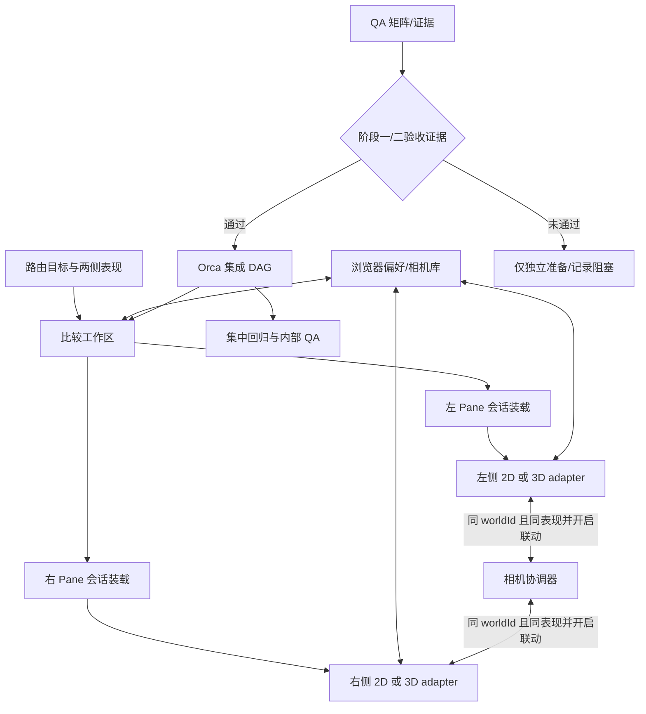

# Possibility 阶段三交付 Plan

> 2026-10-07 追加独立调度（依据用户允许提前开发无门槛依赖模块）：T11 的纯相机联动协调逻辑可基于已提交 T05 类型及注入的 mounted handles 提前实现和定向验证，不导入真实 adapter、renderer、页面或 API。T08/T09 的实际相机边界和真实联动集成仍在 G0 后验收；此次不把 T11 最终集成或 G0 标为通过。

> 2026-10-07 调度更新（用户已授权）：T05 公共契约可先实现；T06 存储、T07 URL 编解码、T10 隔离 fixture 在契约提交后可提前并行开发。上述独立模块不得接入页面、调用真实世界 API 或挂载 renderer。T08/T09、会话和工作区集成仍受 G0 约束；重型验证优先使用已授权 GitHub Actions 的独立 runner。

## 架构概览

阶段三在 React/Vite 世界工作区中建立按 pane 隔离的比较模型。单视口只装载一个 pane；分屏时左右各自持有 `worldId`、`timelineId`、实际访问身份、capabilities、世界时间、表现类型和加载状态。两侧可独立选择 2D 或 3D，支持 2D/2D、3D/3D、2D/3D 和 3D/2D，也允许同一世界的两条时间线或当前身份可访问的两个不同世界。

路由入口继续由现有世界页接管。URL 显式选择优先于浏览器偏好；左右各自的表现值分别更新，不改变未受影响 pane。分屏两侧的会话读取和视口生命周期独立，一侧失败不会卸载另一侧。能力检查使用每个世界实际返回的访问上下文，不信任 URL 中的身份或权限值。

每侧表现由 2D/3D adapter 动态加载和销毁。偏好及相机快照只写当前浏览器；相机按世界、时间线、表现隔离。同 worldId 且表现类型一致时可选联动，跨世界或混合表现时禁止联动。分屏显式持有两个活动视口，关闭或替换一侧时保存该侧相机、取消该侧请求并释放该 renderer。

验收和内部 QA 使用本地真实 API、隔离测试数据与已批准矩阵；固定响应用于确定性回归，真实模型调用独立设限并在执行前确认预算。Orca 使用一个 Run 表达整体依赖 DAG：四份规格获批后先运行只读准备 wave，再核对阶段一/二证据；门槛通过后才派发依赖性集成任务到 `phase3` 子 worktree。协调器独占共享热点的集成和重型验证排期。

## 核心数据结构与接口

以下为拟议的 TypeScript 契约。`Camera` 复用 `web/src/native2d/projection.ts` 的 `{ pan, zoom }`；`OrbitPose` 复用 `web/src/voxel/engine/camera.ts` 的 `{ theta, phi, distance, target }`。

```ts
type PresentationKind = 'voxel3d' | 'native2d'
type PaneId = 'single' | 'left' | 'right'

interface PaneTarget {
  worldId: string
  timelineId?: string
  presentation: PresentationKind
}

interface WorldPresentationContext {
  paneId: PaneId
  worldId: string
  timelineId: string
  presentation: PresentationKind
  identity: 'owner' | 'guest' | 'readonly'
  capabilities: Readonly<Record<string, boolean>>
  stateVersion: number
  simNow: string
}

interface ComparisonTarget {
  left: PaneTarget
  right: PaneTarget
}

type PaneLoadState =
  | { kind: 'loading' }
  | { kind: 'ready'; context: WorldPresentationContext }
  | { kind: 'unsupported'; reason: string }
  | { kind: 'error'; message: string; retryable: boolean }

type CameraSnapshot =
  | { kind: 'voxel3d'; version: 1; pose: OrbitPose }
  | { kind: 'native2d'; version: 1; camera: Camera }

interface PresentationAdapter<K extends PresentationKind> {
  readonly kind: K
  mount(
    host: HTMLElement,
    context: WorldPresentationContext & { presentation: K },
    options: {
      signal: AbortSignal
      camera?: Extract<CameraSnapshot, { kind: K }>
      onCameraChange?: (camera: Extract<CameraSnapshot, { kind: K }>) => void
    },
  ): Promise<MountedPresentation<K>>
}

interface MountedPresentation<K extends PresentationKind> {
  captureCamera(): Extract<CameraSnapshot, { kind: K }> | null
  applyLinkedCamera(camera: Extract<CameraSnapshot, { kind: K }>): void
  dispose(): void
}

interface PresentationStateStore {
  getPreferred(): PresentationKind | null
  setPreferred(kind: PresentationKind): void
  getCamera(target: PaneTarget & { timelineId: string }): CameraSnapshot | null
  setCamera(target: PaneTarget & { timelineId: string }, camera: CameraSnapshot): void
}
```

`canLinkCameras(left, right)` 仅当 `left.worldId === right.worldId` 且表现类型相同时返回 true。adapter 自身负责把相机值应用到自己的视口；协调器只传递同类型快照。

本地记录使用版本化载荷：

- `PresentationPreferenceRecord`: `formatVersion: 1`、`preferredPresentation`、`savedAt`。
- `CameraStateRecord`: `formatVersion: 1`、`worldId`、`timelineId`、`presentation`、相机快照和 `savedAt`。

不兼容/损坏的记录回退到默认值并保留会话；存储不可用不伪报保存成功，也不影响世界数据读取。

Orca 任务继续使用平台 Task/Dispatch 生命周期。每个 Task 描述目标、变更、约束、所有权、可观察验收和证据；上游门槛必须附对应 checklist/执行证据，状态为未核验、通过或阻塞。

## 模块设计

### 世界路由与比较工作区
**职责：** 保留既有单世界 URL，识别单视口、同世界时间线比较和跨世界比较；分别维护左右目标及表现选择。分屏 query 形状为：`/worlds/:leftWorldId?mode=possibility&timeline=:leftTimeline&rightWorld=:rightWorldId&right=:rightTimeline&presentation=:leftKind&rightPresentation=:rightKind`。缺省 `rightWorld` 时，右侧沿用左侧世界并兼容旧链接。

**依赖：** React Router、现有世界/时间线 API 与页面入口。

### Pane 会话装载器
**职责：** 对每侧独立授权并加载世界快照、时间线、实际身份、capabilities、状态版本和世界时间；提供 loading、ready、unsupported、error 状态。

**依赖：** 阶段二冻结的会话和投影契约、各 world 的现有读取 API。两个请求独立取消、重试与错误处理；新授权缺口需要证据后才提出新后端契约。

### 表现注册表与 pane 宿主
**职责：** 根据每侧选择动态导入并挂载对应 adapter；将加载状态、相机快照和 pane 容器传入 adapter；卸载前保存相机并释放资源。

**依赖：** `PresentationAdapter` 契约、pane 上下文和浏览器状态库。

### 原生 2D adapter
**职责：** 将 `Native2dViewport`、原生 2D 场景投影和阶段二账户会话接入单个 pane；左右实例各自处理状态、相机和资源生命周期。

**依赖：** 阶段二 N1/N2 的会话、权限、布局和服务端持久化边界。

### 3D adapter
**职责：** 将 Three.js/体素 viewport 接入任意 pane；每侧可以绑定不同 world/timeline，不依赖固定的主线/分支或 pane 位置。

**依赖：** 现有 VoxelEngine 与场景/时间线加载能力。

### 相机协调器与浏览器状态库
**职责：** 按浏览器保存表现偏好，按 world/timeline/presentation 保存相机。左右相机默认独立；同世界且同表现时允许用户开启/关闭联动。

**依赖：** `PresentationStateStore`、两个 adapter 的受控相机接口。相机联动有防回声控制，销毁/切换目标时保存并清理订阅。

### 阶段三 QA 与证据
**职责：** 执行已批准验收矩阵，记录环境、版本、设备、pane 目标、表现组合、身份/capabilities、时间状态、路径、结果、错误、性能和资源释放；另记录内部 QA 的配对任务完成与回访结果。

**依赖：** 阶段一/二验收证据、本地真实 API、隔离 fixture、Playwright/Vitest 和资源观测。

### Orca 协调器
**职责：** 单一 Run 记录 DAG，分配 Task 与子 worktree，处理 worker_done/question/escalation，确定 settled worker 的复用/保留/释放，集成到 `phase3` 并组织汇合验证。

**依赖：** 四份规格获批；集成派发还依赖阶段一/二门槛通过。第一 wave 仅执行独立准备任务。

## 模块交互



1. 路由解析左右 world/timeline/presentation 目标。单视口只创建 `single` pane；分屏并行创建左右 pane。
2. 两个 pane 分别调用授权与快照读取流程，实际 identity/capabilities 不从 URL 推断。
3. 每个 ready pane 独立解析 adapter，读取自己的相机并挂载；另一个 pane 可以先后处于任意 load state。
4. pane 级切换只取消、保存和销毁该 pane 的旧视口；另一 pane 的世界、时间线、表现和错误状态不变。
5. 相机联动仅在相同 worldId、相同 presentation 且用户开启时传递类型匹配的快照；关闭联动后两边独立。
6. 阶段 gate 的正面证据先于集成 Run wave；门槛不通过时，Orca 只保留准备任务和 blocker，不启动受阻 Dispatch。
7. 汇合后按资源情况串行执行双 3D、双 2D、混合表现和设备矩阵；记录证据后再汇总结论。

## 文件组织

```text
web/src/
├── App.tsx                                      — 保留世界路由与比较 query 参数
├── pages/
│   └── WorldCanvasPage.tsx                     — 接入单视口/比较工作区
├── components/world/presentation/
│   ├── ComparisonHost.tsx                      — 左右目标、独立状态和 pane 生命周期
│   ├── ComparisonPane.tsx                      — 单侧 session 加载/错误/重试
│   ├── PresentationHost.tsx                    — 单侧 adapter 装载与卸载
│   ├── PresentationSwitcher.tsx                — 每侧 2D/3D 选择
│   ├── CameraLinkCoordinator.ts                — 同 worldId、同表现类型的可选联动
│   ├── presentation-route.ts                   — URL 解析、默认值和保参更新
│   ├── presentation-types.ts                   — PaneTarget、上下文、相机和 adapter 契约
│   ├── VoxelPresentationAdapter.tsx             — 3D 任意 pane/world 生命周期
│   ├── comparison.css                           — 工作区和视口布局
│   └── ComparisonHost.test.tsx                  — 权限、失败隔离和联动边界
├── components/world/shell/
│   └── SplitViewStage.tsx                      — 左右 3D pane 分别接收上下文
├── native2d/
│   └── WorldPresentationAdapter.tsx             — 单个 Native2dViewport 的 pane 适配
├── lib/
│   ├── presentation-state.ts                    — 浏览器偏好与逐 pane 相机快照
│   └── presentation-state.test.ts               — 版本、作用域与存储异常
└── e2e/
    ├── presentation.fixtures.ts                 — 两个 world/timeline、差异权限与状态
    ├── presentation-switch.spec.ts              — 单 pane 2D/3D 切换
    ├── presentation-split-worlds.spec.ts        — 同/跨 world 的四种表现组合
    ├── presentation-fallback.spec.ts            — 逐侧拒绝、失败、重试和隔离
    └── presentation-matrix.spec.ts              — viewport、触屏、性能与资源释放

docs/spec_docs/Stage3-delivery/
├── spec.md
├── plan.md
├── task.md
├── checklist.md
└── evidence/
    ├── README.md
    └── qa-matrix.md
```

新增的 E2E fixture 独立于现有共享 split fixture，避免覆盖旧测试。`App.tsx`、`WorldCanvasPage.tsx`、`ComparisonHost.tsx`、`SplitViewStage.tsx`、共享 API 类型/fixture 由单一集成人维护；左右 adapter 与浏览器状态库按独立文件任务分配。

## 技术决策

| 决策点 | 选择 | 理由 |
|---|---|---|
| 比较 URL | `/worlds/:leftWorldId` 表示左侧；`rightWorld`/`right` 指定右侧世界/时间线；`presentation`/`rightPresentation` 分别指定表现 | 可直链、可刷新，且兼容不含 `rightWorld` 的旧同世界链接 |
| 默认表现 | 浏览器偏好是新 pane 默认值；显式 URL 表现优先；默认 3D | 支持长期浏览器偏好和逐 pane 选择 |
| 世界读取/授权 | 左右分别调用现有 world API 并处理结果；不信任 URL 的身份/权限字段 | 避免跨世界权限混用；只有发现既有 API 缺口后才提新服务端契约 |
| 相机 | 独立按 world/timeline/presentation 保存；同 world 且同表现时可选联动；跨世界或混合表现禁用 | 坐标系和相机数据类型需匹配 |
| 双 pane 表现 | 任意一侧可用 2D 或 3D，四种左右组合均为阶段三范围 | 满足已批准 spec 的同/跨世界对照行为 |
| 测试矩阵 | 四种表现组合必须覆盖；再覆盖同/跨世界、左右权限隔离、单侧失败和重试；设备/网络维度使用成对覆盖 | 避免关键组合漏测，同时限制矩阵爆炸 |
| 性能执行 | 先测单 pane，再顺序测双 2D、双 3D、混合；Playwright/Vitest 初始 workers=1；不与其他重型负载并行 | 两个 WebGL renderer 的峰值最高，需要错峰并保留桌面余量 |
| API/模型 | 矩阵调用本地真实 API 与隔离数据；确定性用例固定响应；真实模型另设调用预算并在执行前确认 | 隔离 API 行为与生成随机性，并控制调用成本 |
| Orca | 文档批准后建一个 Run/DAG，先准备 wave 与阶段门槛审计；通过后使用 `new-child` 派发，结果汇入 `phase3` | 确保任务追踪、用户审批、worktree 分支关系和验证证据一致 |
| 规格共享 | `/docs/*` 当前被 `.gitignore` 忽略；获批后将四份规格和证据索引显式纳入 `phase3` | 让所有子 worktree 可读取同一批准版本 |

## Spec 覆盖映射

| Spec 需求 | 归属模块/设计 |
|---|---|
| F1 / N1 / N2 | 比较工作区、Pane 会话装载器、双表现 adapter、逐侧错误状态和相机协调器 |
| F2 | 浏览器表现状态库与版本化相机记录 |
| F3 | `PaneLoadState.unsupported/error` 与 pane 级替代操作 |
| F4 / F5 / N3 / N4 | QA 矩阵、隔离 fixture、证据目录、资源顺序执行与内部 QA |
| F6 / N5 | Orca Run/Task/Dispatch、子 worktree、共享文件唯一集成人 |
| F7 | 阶段一/二证据 gate 和独立准备 wave |
| F8 / N6 | 协调者资源评估、workers=1 起步、重型验证错峰 |
| AC1–AC8 | 对应集成、状态恢复、gate、矩阵、QA、任务证据、资源记录和最终报告 |

## 技术自检

- Spec 覆盖：F1–F8 均有明确模块归属；AC1–AC8 在交互、矩阵或协调流程中有对应验证路径。
- 接口完整：pane 目标、授权后的上下文、加载结果、表现挂载/销毁、相机读写和存储作用域均有定义。
- 依赖清晰：路由 → 比较工作区 → pane 会话装载 → adapter；相机库由 pane/adapter调用，联动器仅连接兼容相机；无模块反向依赖。
- 边界一致：本计划纳入跨 world、双表现和混合 split；公开投票、云端执行、历史空间回放和不相关的大范围重写仍在 spec 明确排除项中。
