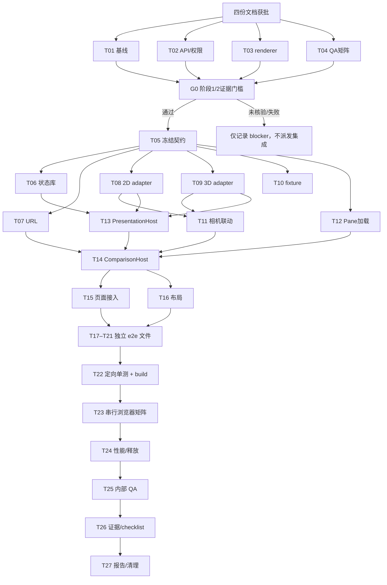

# Possibility 阶段三交付 Tasks

## 文件清单

| 操作 | 文件/工作区 | 职责 |
|---|---|---|
| 新建 | `docs/spec_docs/Stage3-delivery/evidence/baseline.md` | 管理基线、主线改动隔离与阶段 gate 证据 |
| 新建 | `docs/spec_docs/Stage3-delivery/evidence/access-audit.md` | 两侧世界读取、身份与权限 API 盘点 |
| 新建 | `docs/spec_docs/Stage3-delivery/evidence/renderer-audit.md` | 2D/3D 相机与释放生命周期盘点 |
| 新建 | `docs/spec_docs/Stage3-delivery/evidence/qa-matrix.md` | 已批准组合矩阵与内部 QA 记录 |
| 新建 | `web/src/components/world/presentation/presentation-types.ts` | pane、适配器、相机共享契约 |
| 新建 | `web/src/components/world/presentation/presentation-route.ts` | 左右 pane query 解析/更新 |
| 新建 | `web/src/components/world/presentation/presentation-route.test.ts` | URL 同世界/跨世界/保参测试 |
| 新建 | `web/src/lib/presentation-state.ts` | 浏览器偏好和相机记录 |
| 新建 | `web/src/lib/presentation-state.test.ts` | 版本、作用域、损坏和存储失败测试 |
| 新建 | `web/src/native2d/WorldPresentationAdapter.tsx` | 原生 2D pane 适配器 |
| 新建 | `web/src/native2d/WorldPresentationAdapter.test.tsx` | 2D adapter 挂载、相机与销毁测试 |
| 新建 | `web/src/components/world/presentation/VoxelPresentationAdapter.tsx` | 3D pane 适配器 |
| 新建 | `web/src/components/world/presentation/VoxelPresentationAdapter.test.tsx` | 3D 双 world 生命周期测试 |
| 修改 | `web/src/components/world/shell/SplitViewStage.tsx` | 左右 3D pane 独立 world/timeline 接入 |
| 新建 | `web/src/components/world/presentation/CameraLinkCoordinator.ts` | 同 world、同表现的相机联动 |
| 新建 | `web/src/components/world/presentation/CameraLinkCoordinator.test.ts` | 联动边界和回声抑制测试 |
| 新建 | `web/src/components/world/presentation/ComparisonPane.tsx` | 独立 session 加载、状态、错误和重试 |
| 新建 | `web/src/components/world/presentation/ComparisonPane.test.tsx` | pane session 权限、失败与重试测试 |
| 新建 | `web/src/components/world/presentation/PresentationHost.tsx` | 单 pane adapter 装载、相机恢复和销毁 |
| 新建 | `web/src/components/world/presentation/PresentationHost.test.tsx` | adapter 装载、异常与销毁测试 |
| 新建 | `web/src/components/world/presentation/PresentationSwitcher.tsx` | 逐 pane 选择 2D/3D |
| 新建 | `web/src/components/world/presentation/ComparisonHost.tsx` | 单视口/分屏工作区协调 |
| 修改 | `web/src/pages/WorldCanvasPage.tsx` | 接入工作区并保留既有世界管理壳 |
| 新建 | `web/src/components/world/presentation/comparison.css` | 单视口、双 pane、窄屏布局 |
| 新建 | `web/src/components/world/presentation/ComparisonHost.test.tsx` | 权限、单侧失败与联动边界测试 |
| 新建 | `web/e2e/presentation.fixtures.ts` | 两个 world/timeline 与隔离权限 fixture |
| 新建 | `web/e2e/presentation-fixtures.spec.ts` | Playwright fixture 隔离 smoke 场景 |
| 新建 | `web/e2e/presentation-switch.spec.ts` | 单 pane 表现选择、刷新与状态保持 |
| 新建 | `web/e2e/presentation-same-world.spec.ts` | 同 world 双 timeline、四种组合与联动规则 |
| 新建 | `web/e2e/presentation-cross-world.spec.ts` | 跨 world 四种组合、独立时间与权限 |
| 新建 | `web/e2e/presentation-failure.spec.ts` | 左右拒绝、失败、重试和错误隔离 |
| 新建 | `web/e2e/presentation-responsive.spec.ts` | 桌面、窄屏和触屏操作 |
| 新建 | `docs/spec_docs/Stage3-delivery/evidence/README.md` | 证据命名、版本和环境索引 |
| 修改 | `docs/spec_docs/Stage3-delivery/evidence/qa-matrix.md` | 执行结果、限制与未验证项 |
| Orca 状态 | 单 Run、Task、Dispatch、子 worktree | 任务 DAG、负责人、状态、worker 结果和释放决定 |

`.gitignore` 忽略 `/docs/*`。四份批准文档及 evidence 索引须由协调者显式纳入 `phase3` 集成提交，确保后续子 worktree 读取相同版本。

## 执行规则

- **硬门槛：** `spec.md`、`plan.md`、`task.md`、`checklist.md` 全部获得批准前，不派发实现任务。文档批准后，先做 T01–T04 独立准备，再执行 G0。
- **阶段门槛：** G0 通过后才能派发 T05 及之后的集成开发。按 `DEVELOPMENT_ARRANGEMENT.md` 核对阶段一旅程（真实多空间访客→交谈/分叉→认领→所有者管理→编辑→分屏→刷新、真实生成结果、自建单空间/原世界补建对照）和阶段二旅程（事实/规则/画面/证据连续、离页后真实推进回访、2D 账户会话和声明的交互）。缺少验收证据即为“未核验”，不得当作通过；未通过时只保留独立准备和 blocker 报告。
- **worktree 基线：** 所有实现子 worktree 从当前 `phase3` HEAD 创建，不复制或改写 `main` 的未提交改动。每个 wave 完成后协调者把已验证提交依序汇入 `phase3`，再从更新后的 `phase3` 创建依赖 wave，避免下游基于过期分支。
- **文件所有权：** 每个并行任务仅修改表中所属文件；`App.tsx`（如需）、`WorldCanvasPage.tsx`、`ComparisonHost.tsx`、`SplitViewStage.tsx` 和共享 fixture 同一时间只有一个负责人。跨文件新增需求先暂停并更新 task 所有权。
- **并发上限：** 最多 3 个执行槽加协调者，按实际 MemAvailable、`vmstat 1 5` 后续 si/so、memory PSI 和任务 cgroup 限额下调；轻量读取/独立文件开发优先并行。重型浏览器、全量测试和构建不得并发启动；初始 workers=1。
- **验证约定：** 任务中的定向 Vitest 使用 `--maxWorkers=1`。Playwright 编写任务用 `--list` 做轻量验证；真实浏览器矩阵统一由协调者在最终 wave 串行执行。API 用隔离测试数据库/端口，不覆盖用户数据库。真实模型 QA 需先有调用预算，未确认预算不发起模型请求。
- **提交与汇合：** 每个逻辑任务完成后先提交其子 worktree 改动并回报证据；协调者检查 Task/Dispatch 结果后按 wave 串行集成。集成冲突由文件 owner 解决，不让两个执行者同时改热点文件。

## T01：记录基线与工作区隔离

**文件：** `evidence/baseline.md`  
**依赖：** 无；准备 wave，可并行。  
**负责人：** 独立只读审计 worker。

**步骤：**
1. 记录 `phase3` HEAD、分支、工作区状态和 Orca worktree ID。
2. 记录 `main` 的状态仅作隔离说明，不读取或复制其未提交内容。
3. 标明 arrangement 文档来源及本次使用的阶段 gate；列出可见验收证据路径。

**验证：** 文件包含 commit、branch、状态、来源和证据索引；确认没有改动 `main` 或应用代码。

## T02：盘点左右 pane 的读取与权限契约

**文件：** `evidence/access-audit.md`  
**依赖：** 无；准备 wave，可并行。  
**负责人：** 独立只读 API 审计 worker。

**步骤：**
1. 只读定位现有 world/timeline bootstrap、snapshot、public/guest/account 读取入口和能力来源。
2. 记录两个不同 `worldId` 独立授权、`simNow`、状态版本和时间线读取的可用路径。
3. 列出已支持路径和缺口候选，不修改 API；每个候选标注代码/测试证据。

**验证：** 审计文件能为 owner/guest/readonly 三种入口各给出来源或明确标为未核验；没有新增服务端代码。

## T03：盘点两种 renderer 的相机和释放边界

**文件：** `evidence/renderer-audit.md`  
**依赖：** 无；准备 wave，可并行。  
**负责人：** 独立只读渲染审计 worker。

**步骤：**
1. 定位 2D pan/zoom 读写、viewport 创建与销毁路径。
2. 定位 3D OrbitPose 读写、引擎 dispose 与既有 split 清理路径。
3. 记录双实例/异种实例并存时的生命周期风险与可复用测试入口。

**验证：** 记录每项能力的文件/测试来源，并明确尚未实测的部分；不启动浏览器或渲染测试。

## T04：细化验收矩阵与资源计划

**文件：** `evidence/qa-matrix.md`  
**依赖：** 无；准备 wave，可并行。  
**负责人：** 独立 QA 规划 worker。

**步骤：**
1. 列出单 pane、同 world 双 timeline、跨 world 双 pane。
2. 列出 2D/2D、3D/3D、2D/3D、3D/2D 四种分屏组合，以及左右权限差异、单侧失败/重试和相机规则。
3. 将设备/网络/身份维度组织成 pairwise 覆盖，并为双 WebGL、双 2D、混合渲染列出顺序执行批次。

**验证：** 矩阵逐项覆盖 spec AC1、AC4、AC5、AC7；区分固定响应与真实模型调用，模型请求上限标为执行前确认。

## G0：阶段一/二证据门槛

**文件：** 读取 T01–T04 及已有阶段记录；结果写入 `evidence/baseline.md`  
**依赖：** T01、T02、T03、T04。  
**负责人：** 协调者，不派 worker。

**步骤：**
1. 对照 arrangement 的阶段一、二出口，逐项定位可复查的 checklist/实际结果证据。
2. 确认验收对象对应 `phase3` 基线，而不是只看其他 worktree 的未提交文件或聊天说明。
3. 每个出口标为通过、未通过或未核验并附证据。

**验证：** `evidence/baseline.md` 有逐项 gate 结论和来源。全部通过才解锁 T05；任何缺项或未核验均标记 blocker，并停止集成代码任务。

## T05：冻结 pane 与 adapter 契约

**文件：** `web/src/components/world/presentation/presentation-types.ts`  
**依赖：** G0 通过；实现 wave 第一项，先单独集成。  
**负责人：** 公共契约 owner。

**步骤：**
1. 按 plan 定义 `PresentationKind`、`PaneTarget`、`WorldPresentationContext`、`ComparisonTarget`、`PaneLoadState` 与相机判定。
2. 定义 adapter mount、受控相机和 dispose 的最小接口；不将 API 数据模型重复定义在 renderer 中。
3. 记录契约版本，集成后冻结字段；下游变更须先经协调者确认。

**验证：** `npm --workspace web run build` 类型检查通过，且只涉及该契约文件；T05 合入 `phase3` 后再创建依赖 wave。

## T06：实现版本化浏览器表现/相机存储

**文件：** `web/src/lib/presentation-state.ts`、`presentation-state.test.ts`  
**依赖：** T05 已合入；与 T07–T10 并行。  
**负责人：** 独立存储 worker。

**步骤：**
1. 保存当前浏览器默认表现及逐 world/timeline/presentation 相机快照。
2. 校验记录版本和数值；损坏/未知版本使用默认值，不删除用户旧值。
3. 覆盖 localStorage 被禁用、读取/写入异常的降级行为。

**验证：** `npm --workspace web test -- --maxWorkers=1 src/lib/presentation-state.test.ts` 通过，且不读取/写入世界 API。

## T07：实现分屏 URL 编解码

**文件：** `presentation-route.ts`、`presentation-route.test.ts`  
**依赖：** T05 已合入；与 T06、T08–T10 并行。  
**负责人：** 独立路由 worker。

**步骤：**
1. 解析左侧 path/world/timeline 和可选 `rightWorld`/`right`。
2. 解析左右独立 `presentation`/`rightPresentation`，缺省遵循浏览器默认值。
3. 更新单侧选择时保留另一侧、模式和未知兼容 query 参数。

**验证：** `npm --workspace web test -- --maxWorkers=1 src/components/world/presentation/presentation-route.test.ts` 通过；旧同世界 URL 解析结果保持兼容。

## T08：接入原生 2D pane adapter

**文件：** `web/src/native2d/WorldPresentationAdapter.tsx`、`web/src/native2d/WorldPresentationAdapter.test.tsx`  
**依赖：** T05 已合入；与 T06、T07、T09、T10 并行。  
**负责人：** 2D renderer worker，仅拥有 adapter 和对应单测文件。

**步骤：**
1. 将既有 Native2dViewport 装入传入 host，读取对应 pane 的 world/timeline 投影。
2. 暴露 2D Camera 的恢复、变化回报和销毁接口。
3. 支持 AbortSignal 与重复 mount/dispose，单侧取消不影响其他 viewport。

**验证：** `npm --workspace web test -- --maxWorkers=1 src/native2d/WorldPresentationAdapter.test.tsx` 通过，覆盖挂载、相机往返、取消和 dispose。

## T09：接入 3D pane adapter 与跨 world split

**文件：** `VoxelPresentationAdapter.tsx`、`VoxelPresentationAdapter.test.tsx`、`web/src/components/world/shell/SplitViewStage.tsx`  
**依赖：** T05 已合入；与 T06–T08、T10 并行。  
**负责人：** 3D renderer worker；独占 adapter、其单测和 `SplitViewStage.tsx`。

**步骤：**
1. 每个 pane 用自己的 world/timeline bootstrap、场景和 OrbitPose 创建 3D viewport。
2. 将现有同世界分屏改为接收左右独立上下文，并可呈现不同 worldId。
3. 组件卸载或 pane 切换时停止订阅、释放 WebGL renderer/engine。

**验证：** `npm --workspace web test -- --maxWorkers=1 src/components/world/presentation/VoxelPresentationAdapter.test.tsx` 通过，覆盖两个不同 worldId 的两实例创建与分别销毁。Playwright 发现性检查留到相应 E2E 文件创建后执行。

## T10：创建双世界隔离测试 fixture

**文件：** `web/e2e/presentation.fixtures.ts`、`web/e2e/presentation-fixtures.spec.ts`  
**依赖：** T05 已合入、T02 审计完成；与 T06–T09 并行。  
**负责人：** fixture worker，仅拥有新文件。

**步骤：**
1. 定义两个 worldId、各自 timelines、独立 simNow/stateVersion 和不同可访问能力。
2. fixture 能分别设置任一侧未授权、超时、错误和成功结果；每次调用返回独立左右状态。
3. 固定模型响应，不覆盖现有 `split-view-stubs.ts`；增加轻量 smoke spec 引入 fixture 并确认可加载。

**验证：** `cd web && npx playwright test --list e2e/presentation-fixtures.spec.ts` 可发现 smoke 场景；fixture 数据保持只读模板，每次调用返回独立左右状态。完整行为断言在 T23 执行。

## T11：实现相机联动协调器

**文件：** `CameraLinkCoordinator.ts`、`CameraLinkCoordinator.test.ts`  
**依赖：** T05、T08、T09 已合入。  
**负责人：** camera worker；与 T12/T13 并行。  
**步骤：**
1. 仅当 worldId 和 presentation 相同时开放联动。
2. 同类型快照传播需抑制回声循环；关闭联动保留两侧独立相机。
3. 切换 world/timeline/presentation 时销毁旧订阅。

**验证：** `npm --workspace web test -- --maxWorkers=1 src/components/world/presentation/CameraLinkCoordinator.test.ts` 通过，覆盖同世界同表现可联动、跨世界/混合表现拒绝、关闭后不再传播。

## T12：实现单 pane 会话加载与错误状态

**文件：** `ComparisonPane.tsx`、`ComparisonPane.test.tsx`  
**依赖：** T05、T02 已合入；与 T11、T13 并行。  
**负责人：** pane session worker。

**步骤：**
1. 独立加载该 pane 的实际身份、能力、快照与 timeline。
2. 使用 pane 专属 AbortController；提供 retryable/non-retryable 错误状态。
3. 不在加载失败时写 URL 之外的世界变更，也不级联清空兄弟 pane。

**验证：** `npm --workspace web test -- --maxWorkers=1 src/components/world/presentation/ComparisonPane.test.tsx` 通过，覆盖成功/拒绝/超时与单侧重试。

## T13：实现单 pane adapter 生命周期

**文件：** `PresentationHost.tsx`、`PresentationHost.test.tsx`  
**依赖：** T05、T06、T08、T09 已合入；与 T11、T12 并行。  
**负责人：** presentation host worker。

**步骤：**
1. 只动态导入目标 pane 的 adapter，传入该侧 context、signal 与相机。
2. 切换表现前保存相机并释放旧实例；新 adapter 失败时保留可用工作区壳。
3. 确保重复 effect、取消和 unmount 不产生重复 renderer/遗留事件。

**验证：** `npm --workspace web test -- --maxWorkers=1 src/components/world/presentation/PresentationHost.test.tsx` 通过，验证 adapter 只挂载一次、异常后可重试、dispose 正确。

## T14：组装左右比较工作区

**文件：** `ComparisonHost.tsx`、`PresentationSwitcher.tsx`、`ComparisonHost.test.tsx`  
**依赖：** T07、T11、T12、T13 已合入。  
**负责人：** 唯一共享协调器 owner。

**步骤：**
1. 单视口仅创建一个 pane；分屏时各自创建左/右 target 和 host。
2. 提供逐侧 world/timeline/presentation 选择、错误提示、重试和关闭控件。
3. 单侧更新只修改该侧 query/state，保留兄弟 pane 的 session 与视口。

**验证：** `npm --workspace web test -- --maxWorkers=1 src/components/world/presentation/ComparisonHost.test.tsx` 通过；覆盖四种表现组合和一侧失败。

## T15：接入世界页并保留现有管理壳

**文件：** `web/src/pages/WorldCanvasPage.tsx`  
**依赖：** T14 已合入；之后才能开始同文件集成。  
**负责人：** 页面集成人。

**步骤：**
1. 将现有 query 状态映射到 ComparisonHost。
2. 保持 owner/guest/readonly 的管理/只读能力来自各自上下文，不复制业务面板。
3. 保留现有非比较入口与旧同世界分屏 URL 行为。

**验证：** `npm --workspace web run build` 通过；`cd web && npx playwright test --list e2e/split-view.spec.ts` 可发现旧同世界分屏场景。新单 pane 场景由 T17 创建后验证。

## T16：完成双 pane 布局与窄屏入口

**文件：** `comparison.css`、必要的 `PresentationSwitcher.tsx` 控件样式  
**依赖：** T14 已合入；与 T15 页面接入并行。  
**负责人：** 样式 worker，不改路由/会话代码。

**步骤：**
1. 桌面双 pane 等高显示，各自的时间、权限和表现可辨认。
2. 528×720、390×844 提供可达的切侧/选择入口，不让控制栏覆盖主视口。
3. loading/error/unsupported 状态不遮蔽另一侧可用 pane。

**验证：** `npm --workspace web test -- --maxWorkers=1 src/components/world/presentation/ComparisonHost.test.tsx` 通过，断言两侧入口与状态可见；实际桌面/窄屏/触屏观察由最终 Playwright wave 执行。

## T17：编写单视口切换与恢复 e2e

**文件：** `web/e2e/presentation-switch.spec.ts`  
**依赖：** T15、T16 已合入。  
**负责人：** 独立测试 worker。

**步骤：**
1. 验证单世界 2D↔3D 切换保留 world/timeline、身份和历史。
2. 验证刷新后浏览器表现偏好、按表现保存的相机恢复。
3. 验证显式 URL 表现覆盖偏好、切换保留其他 query。

**验证：** `cd web && npx playwright test --list e2e/presentation-switch.spec.ts` 可发现所有场景；实际测试在 T23 执行。

## T18：编写同世界双时间线 e2e

**文件：** `web/e2e/presentation-same-world.spec.ts`  
**依赖：** T15、T16 已合入。  
**负责人：** 独立测试 worker，和 T17、T19 可并行。

**步骤：**
1. 验证同一 worldId 的两个 timeline 显示各自时间与事件。
2. 覆盖 2D/2D、3D/3D、2D/3D、3D/2D 四种左右组合。
3. 验证同世界同表现可选相机联动，混合表现不能联动。

**验证：** `cd web && npx playwright test --list e2e/presentation-same-world.spec.ts` 可发现所有场景且 fixture 不共享可变 timeline 状态；浏览器执行在 T23。

## T19：编写跨世界 e2e

**文件：** `web/e2e/presentation-cross-world.spec.ts`  
**依赖：** T15、T16、T10 已合入。  
**负责人：** 独立测试 worker，和 T17/T18 可并行。

**步骤：**
1. 验证两个可访问 worldId 各自显示其 timeline、simNow、身份和能力。
2. 覆盖 2D/2D、3D/3D、2D/3D、3D/2D。
3. 验证不同 world 相机始终独立、刷新后路由可恢复。

**验证：** `cd web && npx playwright test --list e2e/presentation-cross-world.spec.ts` 可发现所有场景，断言明确分别引用左右 worldId；浏览器执行在 T23。

## T20：编写 pane 失败与权限隔离 e2e

**文件：** `web/e2e/presentation-failure.spec.ts`  
**依赖：** T15、T16、T10 已合入；与 T17–T19 并行。  
**负责人：** 独立测试 worker。

**步骤：**
1. 左右分别模拟未授权、API 错误和可重试超时。
2. 验证失败侧显示自己的原因/重试入口，可用侧可继续交互。
3. 验证重试只重新加载失败侧，URL 不构成授权。

**验证：** `cd web && npx playwright test --list e2e/presentation-failure.spec.ts` 可发现所有场景；fixture 负例不把一个 world 的能力复制到另一个。

## T21：编写响应式 e2e

**文件：** `web/e2e/presentation-responsive.spec.ts`  
**依赖：** T15、T16 已合入；与 T17–T20 并行。  
**负责人：** 独立测试 worker。

**步骤：**
1. 覆盖 1280×720、528×720 和 390×844。
2. 在触屏窄屏下切换当前 pane、选择表现和重试错误 pane。
3. 断言两侧身份/时间标签可见，交互目标可操作且无水平溢出。

**验证：** `cd web && npx playwright test --list e2e/presentation-responsive.spec.ts` 可发现所有场景；实际移动浏览器只在 T23 串行执行。

## T22：定向单测与构建汇合

**文件：** 无新增代码；读取全部实现与测试。  
**依赖：** T06–T21 全部合入。  
**负责人：** 协调者；独占重型验证时段。

**步骤：**
1. 资源检查通过后，以 `--maxWorkers=1` 运行新增状态/路由/比较组件定向测试。
2. 运行 `npm --workspace web run build`。
3. 有失败则按已有文件 owner 建单一修复 Task，修复合入后重跑失败的定向验证。

**验证：** 定向 Vitest 和 Web build 均退出码 0；记录命令、commit 和实际结果。

## T23：串行执行浏览器交付矩阵

**文件：** `evidence/qa-matrix.md` 与 Playwright 结果目录。  
**依赖：** T22 通过；G0 仍为通过。  
**负责人：** 协调者；不可与其他重型任务并发。

**步骤：**
1. 运行单视口切换、同 world、跨 world、四种表现组合、左右失败和相机规则测试。
2. 分批运行桌面与移动/触屏项目，workers=1；每组结束检查服务与浏览器进程。
3. 记录实际浏览器、视口、commit、路径、断言和未覆盖限制。

**验证：** 矩阵每项标通过/失败/未运行并链接原始 trace/screenshot/log；没有以 `--list` 代替场景执行。

## T24：测量双视口性能和资源释放

**文件：** `evidence/qa-matrix.md`  
**依赖：** T23 基础场景通过、T03 资源审计完成。  
**负责人：** 协调者；独占浏览器与观测环境。

**步骤：**
1. 先记录单 2D、单 3D 基线，再分别测双 2D、双 3D、混合表现冷/热加载。
2. 观察视口关闭、切换和离开后 renderer/worker/订阅是否释放。
3. 启动前检查 MemAvailable、vmstat、memory PSI 和测试 cgroup；压力升高即降并发/错峰，不改系统 swap 设置。

**验证：** 文件含实测延迟/资源读数和测量条件、基线差值及限制；出现超出当前环境能力的项时如实记为未验证。

## T25：执行内部 QA 配对任务

**文件：** `evidence/qa-matrix.md`  
**依赖：** T23、T24 通过；准备相同主题、人物、检查点和任务。  
**负责人：** 协调者和内部测试者；不派公开参与者。

**步骤：**
1. 用相同初始 world/timeline 条件分别体验 2D/3D 和已批准 split 组合。
2. 记录任务完成、错误、性能和回访状态；不记录 API 密钥或原始私人对话。
3. 如场景需要真实模型调用，先向用户确认预算上限和模型配置，再单独运行有限调用；未获预算时保留该项为未验证。

**验证：** QA 记录能按配对条件比较结果并注明环境/限制；没有公开投票或未确认的模型调用。

## T26：整理证据索引与 checklist 结果

**文件：** `evidence/README.md`、`evidence/qa-matrix.md`、`checklist.md`  
**依赖：** T22–T25 已完成。  
**负责人：** 文档 owner。

**步骤：**
1. 将 AC1–AC8 映射到实际验证和原始输出。
2. 标明通过、未通过、未验证、阻塞及其证据链接。
3. 将文档从忽略状态显式纳入 `phase3`，不复制 `main` 未提交文件。

**验证：** 每项 checklist 有实际结果与路径；空结果不标通过；文件可在 `git status`/索引中确认被纳入。

## T27：最终阶段报告与 worktree 清理

**文件：** Orca Run/Task/Dispatch 状态、`checklist.md`、`evidence/README.md`  
**依赖：** T26 完成；所有 worker 有明确 settled 结果。  
**负责人：** 协调者。

**步骤：**
1. 按 AC1–AC8 汇总实际结果和仍未验证/失败项。
2. 对每个已 settled worker 选择复用、按用户要求保留或 Orca release；未 settled 不关闭或清理。
3. 确认没有遗留未归属的阶段三任务；工作区保留 `phase3` 集成结果。

**验证：** 最终报告有每项证据，公开用户评估/投票标明延期；Orca 当前 Run 的 worker 列表无待决 settled 终端。

## 执行顺序与最大并行批次

| Wave | 可并行任务 | 最大活动执行槽 | 汇合规则 |
|---|---|---:|---|
| 准备 wave | T01、T02、T03、T04 | 3 | 轻量只读/文档任务最多 3 个 worker；完成后协调者执行 G0 |
| 契约 wave | T05 | 1 | T05 单独合入 `phase3`，冻结公共接口 |
| 独立模块 wave | T06、T07、T08、T09、T10 | 3 | 每次最多 3 个独立 worktree；任务文件不重叠；先全部汇入再开依赖 wave |
| 协调模块 wave | T11、T12、T13 | 3 | T11 等两 renderer 合入；T12/T13 共享契约但不改共享 host |
| 共享集成 wave | T14；随后 T15、T16 | 2 | ComparisonHost 先合入；WorldCanvasPage 与独立样式可并行合入；热点文件单一 owner |
| e2e 编写 wave | T17、T18、T19、T20、T21 | 3 | 独立测试文件可并行编写；仅轻量 `--list`，不并发启动浏览器 |
| 验收 wave | T22–T27 | 1 | 单测/build/浏览器/性能/内部 QA 由协调者按资源情况顺序执行 |

“最大活动执行槽”是资源允许时的上限，不是固定并发。每个 worker 使用独立 `new-child` worktree，子任务合入 `phase3` 后才创建依赖 wave。若门槛 G0 未通过，T05–T27 保持未派发；准备任务和 blocker 报告不视作阶段三实现完成。
