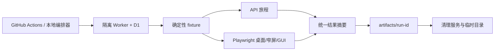

# 核心闭环阶段 0 与阶段 1A Plan

## 架构概览

本轮采用五个协作组件，全部围绕现有真实入口组织：

1. **基线证据编排器**：启动隔离数据库、确定性 fixture 和前端入口，按 BB-01～BB-18 及补充回归项执行 API/浏览器/GUI 旅程，统一收集版本、上下文、响应摘要、页面状态、截图和清理结果，输出到 `artifacts/`。
2. **场景候选管线**：将世界骨架和用户描述转换为规范化的体素场景候选，补足入口空间、地点/居民绑定和必要结构；生成失败达到上限时选择确定性的最小合法场景。
3. **统一兼容门禁与提交协调器**：用现有兼容规则对候选执行最终检查，生成包含版本、内容哈希、规则/资产/绑定指纹的校验依据；世界创建、修复提交和首次进入都必须通过同一门禁，并在请求标识下幂等提交。
4. **修复与状态恢复界面**：在创建页、场景检查面板和修复预览中展示问题、建议、写入状态和下一步；保留草稿和请求状态，支持刷新、断流、过期基准和超时后的查询/重试/保底路径。
5. **隔离验证工作流**：复用仓库现有的本地 Worker、D1 和 Playwright 启动方式，在 GitHub Actions `ubuntu-24.04` 上串行运行 API 单测、Web 单测、桌面/窄屏浏览器和 GUI 检查，上传脱敏证据并确认临时资源退出。

数据流为：

```text
新世界输入
  → 世界骨架 + 场景生成
  → 场景规范化
  → 统一兼容检查
  ├─ 通过 → 带校验依据的幂等世界创建 → 首次进入/刷新
  ├─ 未通过 → 可执行修复草稿 → 再检查 → 提交新版本
  └─ 达到失败上限 → 确定性最小合法场景 → 标记保底 → 创建并保留修复入口
```

阶段 0 的证据编排器与阶段 1A 的场景管线共享相同的兼容检查和状态摘要，从而能直接证明“用户检查结果”和“保存前最终结果”一致；未属于 BB-01 的问题只产生基线记录，不进入本轮提交路径。

## 核心数据结构

以下结构优先复用 `@possibility/voxel-contract` 中已有的 `SceneCandidate`、`SceneValidationBasis`、`SceneValidationReport`、`SceneIssue`、`SerializedVoxelDocument`/`SerializedVoxelSpaces`，新增结构只承载本轮的编排状态和证据。

### `BaselineRunManifest`

阶段 0 一次独立运行的总记录：

```ts
interface BaselineRunManifest {
  runId: string
  gitSha: string
  startedAt: string
  environment: { runner: string; viewportSet: string[]; dataMode: string }
  cases: BaselineCaseResult[]
  cleanup: { servicesStopped: boolean; tempPathsRemoved: boolean }
}
```

### `BaselineCaseResult`

一项 BB 或补充回归项的可复查结果：

```ts
interface BaselineCaseResult {
  caseId: string
  category: 'bb' | 'supplemental'
  entry: string
  identity: string
  context: {
    worldId: string | null
    timelineId: string | null
    spaceId: string | null
    simNow: string | null
  }
  status: 'passed' | 'failed' | 'unverified'
  http: Array<{ method: string; path: string; status: number }>
  page: { url: string | null; labels: string[]; screenshotPath?: string }
  evidencePaths: string[]
  failure?: { summary: string; nextStep: string }
}
```

### `NormalizedSceneCandidate`

规范化后的候选，作为兼容检查和保存门禁唯一输入：

```ts
interface NormalizedSceneCandidate {
  candidate: SceneCandidate
  document: SerializedVoxelDocument | SerializedVoxelSpaces
  normalizationFixes: Array<{ code: string; summary: string }>
  source: 'generated' | 'edited' | 'fallback'
  attempt: number
  requestId: string
  contentHash: string
}
```

### `SceneGateResult`

统一检查/保存前的结果：

```ts
interface SceneGateResult {
  status: 'valid' | 'invalid' | 'incomplete'
  candidate: NormalizedSceneCandidate
  report: SceneValidationReport
  basis: SceneValidationBasis
  actions: Array<'retry' | 'recheck' | 'repair' | 'use-fallback' | 'enter'>
  persisted: boolean
  fallback: boolean
}
```

### `SceneCreateOperation`

创建请求在断流、刷新和重试间的持久身份：

```ts
interface SceneCreateOperation {
  requestId: string
  fingerprint: string
  status: 'pending' | 'completed' | 'failed' | 'recoverable'
  worldId: string | null
  timelineId: string | null
  sceneVersion: number | null
  attempts: number
  lastError: { code: string; message: string } | null
}
```

### 核心接口

```ts
normalizeSceneCandidate(
  raw: unknown,
  bindings: SceneBindingContext,
  options: { source: NormalizedSceneCandidate['source']; requestId: string; attempt: number },
): Promise<NormalizedSceneCandidate>

generateSceneCandidate(
  request: { prompt: string; world: WorldDraft; personIds: string[]; requestId: string },
  deps: { provider: DeterministicSceneProvider },
): Promise<NormalizedSceneCandidate>

evaluateSceneCandidate(
  input: { worldId?: string; candidate: NormalizedSceneCandidate; access: SceneValidationAccess },
): Promise<SceneGateResult>

buildDeterministicFallback(
  input: { world: WorldDraft; bindings: SceneBindingContext; requestId: string },
): Promise<NormalizedSceneCandidate>

commitWorldCreation(
  input: { operation: SceneCreateOperation; world: WorldDraft; candidate: NormalizedSceneCandidate; gate: SceneGateResult },
): Promise<{ worldId: string; timelineId: string; sceneVersion: number }>

runBaselineMatrix(
  config: { apiTarget: string; webTarget: string; outputDir: string; viewports: Array<{ width: number; height: number }> },
): Promise<BaselineRunManifest>
```

`DeterministicSceneProvider` 只在测试和阶段 0/1A 验证中注入；生产路径继续由现有 provider 适配层提供实现。所有接口都要求服务端重新解析 world/timeline/space/bindings，客户端只能提交请求标识、草稿标识和乐观版本。

## 模块设计

### 1. 基线证据编排

**职责：** 在独立 D1、Worker 和 Web 进程中复测 BB-01～BB-18 及补充项，记录每项的上下文、请求摘要、页面状态和证据，结束时清理临时进程与目录。

**拟修改/新增文件：**

- `scripts/phase1-core-loop-baseline.mjs`：负责运行标识、隔离数据目录、服务启动/健康检查、Playwright 调用和最终汇总。
- `web/scripts/phase1-core-loop-baseline.acceptance.ts`：执行桌面、`485×724`、`390×844` 入口旅程，写入 `BaselineRunManifest` 所需的页面和截图结果。
- `web/e2e/phase1-core-loop.spec.ts`：补充阶段 0/1A 的真实 HTTP/UI 断言，复用既有 scene compatibility fixture 和测试账号。
- `artifacts/phase1-core-loop/<run-id>/`：保存 JSON 矩阵、请求摘要、脱敏日志、截图、构建版本和清理结果，不纳入运行时代码。

**依赖：** 现有 `api/scripts/start-s02-e2e.mjs`、Playwright 配置、场景兼容 fixture；只允许一个浏览器 worker 和一个 GUI 实例。

### 2. 场景候选与规范化

**职责：** 将生成/编辑结果转换为规范化候选，校验地点、居民、入口和表现结构；在确定性失败上限后构造最小合法场景。

**拟修改/新增文件：**

- `api/src/scenes/voxel-draft.ts`：让生成流程通过可注入的确定性 provider，统一记录尝试次数、规范化修复和调用计数。
- `api/src/voxel/normalize.ts`、`api/src/voxel/generate.ts`：集中输出结构化的规范化结果和失败原因，避免生成端与保存端各自修补。
- `api/src/scenes/fallback.ts`（新建）：根据世界地点和绑定生成固定拓扑、入口、道路和最小建筑的保底文档。
- `api/src/scenes/voxel-draft.test.ts`、`api/src/voxel/normalize.test.ts`：覆盖相同输入哈希稳定、绑定缺失、道路/入口问题、失败上限和保底结果。

**依赖：** `@possibility/voxel-contract` 的文档类型、资产清单和服务端解析出的 `SceneBindingContext`。

### 3. 统一兼容门禁与世界创建提交

**职责：** 让创建、修复、恢复和首次进入共享同一份最终检查；在服务端重建校验依据，原子地提交世界、时间线和场景版本，并按请求标识幂等恢复。

**拟修改文件：**

- `api/src/scenes/compatibility/service.ts`：抽出候选规范化后的统一 gate 调用，确保 inspection、preflight 和 confirm 使用同一 `SceneValidationBasis`。
- `api/src/scenes/compatibility/context.ts`、`api/src/scenes/compatibility/http.ts`：补充入口/道路/室内问题的可执行 action 映射和脱敏摘要。
- `api/src/worlds/routes.ts`：在创建事务写入前执行最终 gate；拒绝 invalid/incomplete；复用 `sceneRequestId` 和 fingerprint 返回同一结果。
- `api/src/scenes/routes.ts`、`api/src/scenes/compatibility/routes.ts`：让修复草稿、预检、确认和 recover 返回统一状态与下一步动作。
- `api/src/worlds/create-voxel.test.ts`、`api/src/scenes/compatibility/routes.test.ts`、`api/src/scenes/repair.test.ts`：覆盖拒绝无效场景、基准过期、重复请求、断流恢复、跨世界权限和保底提交。

**依赖：** 现有 D1 schema、事务/写入 guard、场景 repository 和兼容 contract；不接受客户端提供的 bindings、basis 或权限字段。

### 4. 创建与修复界面状态

**职责：** 让用户看见当前检查状态、问题建议、写入状态和恢复动作；刷新后保留原请求和草稿；保底结果仍可进入并能回到修复入口。

**拟修改文件：**

- `web/src/pages/WorldCreate.tsx`：把生成后的候选先纳入最终 gate 状态，展示检查通过/问题/保底标记，并在创建请求断流后查询同一 `sceneRequestId`。
- `web/src/components/scene/SceneCompatibilityPanel.tsx`、`SceneRepairPreview.tsx`：复用统一 action 文案，显示前后变化、过期原因、重试/重检/使用保底/继续修复按钮。
- `web/src/scene/create-draft-store.ts`：持久化 prompt、居民选择、候选摘要、请求标识和最后状态；仅在成功创建后清理。
- `web/src/api/client.ts`、`web/src/api/types.ts`：补齐 gate、fallback、recover 和下一步 action 的 DTO，客户端不发送服务端权威字段。
- `web/src/pages/WorldSceneRepair.tsx`：接入同一修复结果和保底入口，确保刷新后仍能读取场景版本和修复上下文。

**依赖：** 现有 `VoxelViewport`、scene compatibility polling/session、world scene API；桌面和两个窄屏视口共用同一状态模型。

### 5. Contract、错误文案与验证

**职责：** 稳定跨 API/UI 的结果形状，避免内部字段直接出现在用户界面，并为阶段 0/1A 提供可观察断言。

**拟修改文件：**

- `packages/voxel-contract/src/scene-compatibility.ts`：补充 fallback 标识、统一 action 类型和可脱敏的结果字段；保持旧字段兼容。
- `api/src/scenes/error-copy.ts`：集中把 issue code/category 映射为用户可理解的摘要、影响和建议。
- `web/src/components/scene/*.test.tsx`、`web/src/scene/*.test.ts`：覆盖文案、键盘焦点、状态恢复和重复提交。
- `.github/workflows/phase1-core-loop-acceptance.yml`（新建）：在 `ubuntu-24.04` 串行执行构建、API/Web 单测、桌面/移动 Playwright 和证据上传，并校验临时服务退出。

**依赖：** 现有 workspace build/test 命令和 Playwright 配置；不注入真实模型密钥。

## 模块交互

阶段 0 的证据流：



阶段 1A 的创建流：

1. `WorldCreate` 保存 prompt、居民选择和 `sceneRequestId`，调用场景草稿入口。
2. 服务端生成世界骨架，调用确定性 provider，得到候选后立即规范化；服务端解析地点/居民绑定，不接受客户端权威绑定。
3. UI 展示候选并启动最终兼容检查；检查和保存前 gate 使用同一场景版本、内容哈希、规则版本、资产指纹和绑定指纹。
4. gate 通过时，世界创建路由在一个事务中写入世界、主时间线、居民关系和首个场景版本；相同 fingerprint/request id 的重试返回原结果。
5. 创建成功后才清理浏览器草稿；UI 读取 bootstrap/snapshot，刷新后由世界路由重新加载已提交场景。

无效候选和修复流：

1. gate 返回问题集合和 action；UI 显示问题、影响、建议、写入状态和“重试/重新检查/修复/使用保底”入口。
2. 修复入口创建带当前版本和校验依据的草稿；服务端加载当前场景和上下文，生成候选并再次运行相同 gate。
3. 依据未变化时，确认接口原子提交一个新版本；依据变化、草稿过期或请求重复时返回可恢复状态，不覆盖较新的场景。
4. 浏览器断流/刷新时，UI 用持久的 request id 查询状态；服务端根据提交记录返回 completed、failed-retryable 或 recoverable，避免重复生成。

失败保底流：

1. 生成/修复尝试达到配置上限，候选管线调用确定性保底构造器。
2. 保底文档通过同一 gate 后以 `source='fallback'` 和可读说明提交。
3. 首次进入和刷新读取保底场景；修复入口继续绑定当前场景版本，后续修复不改变原始请求的幂等结果。

阶段 0 和阶段 1A 的证据均在 gate、提交和 UI 层采集同一组摘要字段，因此可以验证“检查看到的状态”与“最终保存的状态”一致。

## 文件组织

```text
docs/spec_docs/phase1-core-loop/
├── spec.md
├── plan.md
├── task.md
└── checklist.md

scripts/
└── phase1-core-loop-baseline.mjs

web/
├── scripts/phase1-core-loop-baseline.acceptance.ts
├── e2e/phase1-core-loop.spec.ts
├── src/pages/WorldCreate.tsx
├── src/pages/WorldSceneRepair.tsx
├── src/components/scene/SceneCompatibilityPanel.tsx
├── src/components/scene/SceneRepairPreview.tsx
├── src/scene/create-draft-store.ts
├── src/api/client.ts
└── src/api/types.ts

api/
├── src/scenes/voxel-draft.ts
├── src/scenes/fallback.ts
├── src/scenes/error-copy.ts
├── src/scenes/compatibility/service.ts
├── src/scenes/compatibility/context.ts
├── src/scenes/compatibility/http.ts
├── src/scenes/compatibility/routes.ts
├── src/scenes/routes.ts
├── src/voxel/generate.ts
├── src/voxel/normalize.ts
├── src/worlds/routes.ts
├── src/scenes/voxel-draft.test.ts
├── src/voxel/normalize.test.ts
├── src/worlds/create-voxel.test.ts
├── src/scenes/compatibility/routes.test.ts
└── src/scenes/repair.test.ts

packages/voxel-contract/src/
└── scene-compatibility.ts

.github/workflows/
└── phase1-core-loop-acceptance.yml

artifacts/phase1-core-loop/<run-id>/
├── matrix.json
├── logs/
├── screenshots/
└── build-info.json
```

## 技术决策

| 决策点 | 选择 | 理由 |
|---|---|---|
| 兼容规则归属 | 继续使用 `@possibility/voxel-contract` + `api/src/scenes/compatibility/service.ts` | 避免生成、检查和保存各自维护一套规则，直接满足 F4/AC3 |
| 候选规范化 | 在现有生成/规范化链上增加统一结果包装，不另建第二套场景格式 | 保持现有存储和渲染兼容，集中记录修复变化和内容哈希 |
| 保底策略 | 服务端确定性构造最小场景，并再次通过同一 gate | 不依赖真实模型，能够复现并保证首次可进入 |
| 创建事务 | 复用现有 `sceneRequestId`、fingerprint、稳定 ID 和 D1 写入 guard | 断流/重复提交可以返回原结果，不产生重复世界 |
| 修复并发 | 继续使用 `SceneValidationBasis` 的版本、哈希和上下文指纹做乐观并发检查 | 草稿过期时能安全拒绝，避免覆盖较新场景 |
| 结果呈现 | contract 提供结构化 action；`error-copy.ts` 统一转为用户文案 | 页面不暴露 UUID、内部错误码或资产字段 |
| 客户端恢复 | 扩展现有 `createDraftStore` 与请求状态查询，成功后才清理 | 刷新、断流和网络失败可以回到同一个创建请求 |
| 阶段 0 证据 | 新增编排脚本和 Playwright 旅程，输出到 `artifacts/`；不修改其他问题的业务逻辑 | 使所有 BB 项都有当前版本证据，同时保持本轮范围 |
| 重型验证 | 使用已授权的 GitHub Actions `ubuntu-24.04`，`workers=1`、独立 D1/临时目录 | 控制内存、显存和 `/tmp` 风险，结果可复查 |
| 模型依赖 | 测试注入确定性 provider；不需要真实模型密钥 | 与本轮“只允许 fixture/替身”约束一致 |
| 数据库变更 | 优先复用现有 scene request/revision 字段保存状态和保底标记；只有现有 schema 无法表达时才新增最小迁移 | 降低迁移风险，避免扩大本轮范围 |

## Spec 覆盖

| Spec 项 | 设计归属 |
|---|---|
| F1–F2 | 基线证据编排、`BaselineRunManifest`、隔离验证工作流 |
| F3 | 场景候选与规范化模块、`NormalizedSceneCandidate` |
| F4 | 统一兼容门禁与世界创建提交、`SceneGateResult` |
| F5 | `error-copy.ts`、contract action 和创建/修复界面 |
| F6 | 修复草稿、版本/指纹 gate、`SceneRepairPreview` |
| F7 | `fallback.ts`、保底提交与 UI 标识 |
| F8 | `SceneCreateOperation`、请求查询/recover、D1 幂等 guard |
| F9 | `WorldCreate`、阶段 1A Playwright 连续旅程 |
| N1–N5 | 确定性 provider、统一 basis、原子提交、结构化证据 |
| N6 | 创建/修复 UI、三个视口和键盘/触摸断言 |
| N7 | GitHub Actions 隔离数据库、临时目录和单 worker |
| N8 | 现有兼容/API/Web 测试与合法演示世界回归 |
